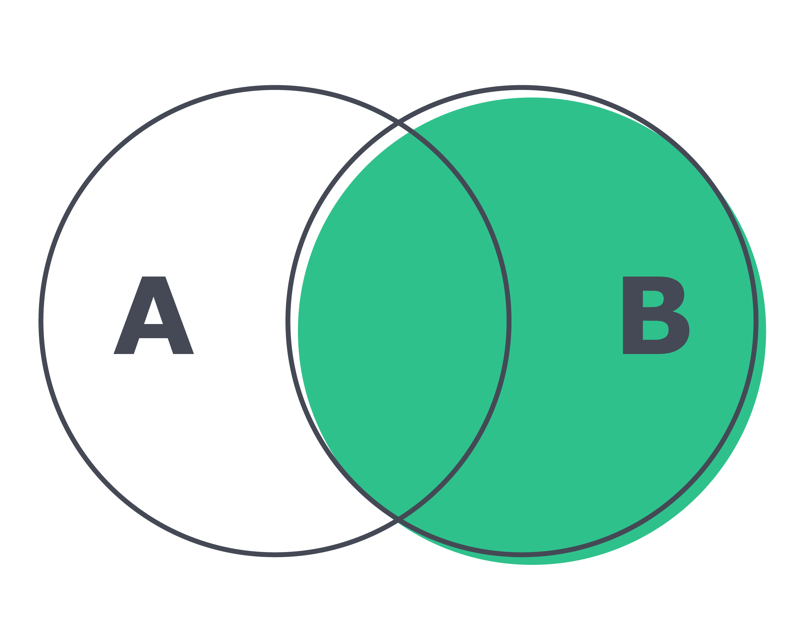

# Funções mais usadas no sql

## Manipulação de strings:

* Converte o texto da string para **CAIXA ALTA**;

```sql
SELECT UCASE('Oi, eu sou uma string');

SELECT UCASE(title) FROM sakila.film LIMIT 10;
```

* Converte o texto da string para **caixa baixa**;

```sql
SELECT LCASE('OI, EU SOU UMA STRING');

SELECT LCASE(title) FROM sakila.film LIMIT 10;
```

* Substitui as ocorrências de uma substring em uma string;

```sql
SELECT REPLACE('Oi, eu sou uma string', 'string', 'cadeia de caracteres');

SELECT REPLACE(title, 'ACADEMY', 'FOO') FROM sakila.film WHERE film_id = 1;
```
* Retorna a parte da esquerda de uma string de acordo com o número de caracteres especificado;

```sql
SELECT LEFT('Oi, eu sou uma string', 3);

SELECT LEFT(title, 7) FROM sakila.film WHERE film_id = 1;
```

* Retorna a parte da direita de uma string de acordo com o número de caracteres especificado;

```sql
SELECT RIGHT('Oi, eu sou um string', 6);

SELECT RIGHT(title, 8) FROM sakila.film WHERE film_id = 1;

```

* Exibe o tamanho, em caracteres, da string;

```sql
SELECT LENGTH('Oi, eu sou uma string');

SELECT LENGTH(title) FROM sakila.film WHERE film_id = 1;

```

* Extrai parte de uma string de acordo com o índice de um caractere inicial e a quantidade de caracteres a extrair;

```sql
SELECT SUBSTRING('Oi, eu sou uma string', 5, 2);

SELECT SUBSTRING(title, 5, 2) FROM sakila.film WHERE film_id = 1;
```

* Se a quantidade de caracteres a extrair não for definida, então a string será extraída do índice inicial definido, até o seu final;

```sql
SELECT SUBSTRING('Oi, eu sou uma string', 5);

SELECT SUBSTRING(title, 5) FROM sakila.film WHERE film_id = 1;

SELECT SUBSTRING('A linguagem JavaScript está entre as mais usadas', 12, 10)
-- JavaScript
```

#### Condicionais:

**IF:** 
```sql
SELECT film_id, title, IF(title = 'ACE GOLDFINGER', 'Já assisti a esse filme', 'Não conheço o filme') AS 'conheço o filme?'
FROM sakila.film
```

**CASE:** 
```sql
SELECT 
    title,
    rating,
    CASE
        WHEN rating = 'G' THEN 'Livre para todos'
        WHEN rating = 'PG' THEN 'Não recomendado para menores de 10 anos'
        WHEN rating = 'PG-13' THEN 'Não recomendado para menores de 13 anos'
        WHEN rating = 'R' THEN 'Não recomendado para menores de 17 anos'
        ELSE 'Proibido para menores de idade'
    END AS 'público-alvo'
FROM
    sakila.film;
```

#### Funções matemáticas do MySQL:

**Adição:**
```sql
SELECT 5 + 5;

SELECT rental_duration + rental_rate FROM sakila.film LIMIT 10;

```

**Subtração:**
```sql
SELECT 5 - 5;

SELECT rental_duration - rental_rate FROM sakila.film LIMIT 10;

```

**Multiplicação:**
```sql
SELECT 5 * 5;

SELECT rental_duration * rental_rate FROM sakila.film LIMIT 10;

```

**Divisão:**
```sql
SELECT 5 / 5;

SELECT rental_duration / rental_rate FROM sakila.film LIMIT 10;

```

**DIV:**
* Retorna o resultado inteiro de uma divisão, ignorando (o resto da divisão) as casas decimais de um número:
```sql
SELECT 10 DIV 3; -- 3
SELECT 10 DIV 2; -- 5
SELECT 14 DIV 3; -- 4
SELECT 13 DIV 2; -- 6
```
**MOD:**
*  Retorna o resto de uma divisão como resultado:
```sql
SELECT 10 MOD 3; -- 1
SELECT 10 MOD 2; -- 0
SELECT 14 MOD 3; -- 2
SELECT 13 MOD 2; -- 1
SELECT 10.5 MOD 2; -- 0.5, ou seja, 2 + 2 + 2 + 2 + 2 = 10, restando 0.5

SELECT IF(15 MOD 2 = 0, 'Par', 'ímpar') AS 'Par ou Ímpar';

SELECT 220 MOD 12; -- 4
```

**ROUND:**
* Arredonda os números de acordo com sua parte decimal. Se for maior ou igual a 0.5, o resultado é um arredondamento para cima. Caso contrário, ocorre um arredondamento para baixo;

```sql
-- Podemos omitir ou especificar quantas casas decimais queremos
SELECT ROUND(10.4925); -- 10
SELECT ROUND(10.5136); -- 11
SELECT ROUND(-10.5136); -- -11
SELECT ROUND(10.4925, 2); -- 10.49
SELECT ROUND(10.4925, 3); -- 10.493

SELECT ROUND(15.75, 5); -- '15.75000'
```

**CEIL:**
* Arredondamento sempre para cima:

```sql
SELECT CEIL(10.51); -- 11
SELECT CEIL(10.49); -- 11
SELECT CEIL(10.2); -- 11
SELECT CEIL(85.234); -- 86
```

**FLOOR:**
* Arredondamento sempre para baixo:

```sql
SELECT FLOOR(10.51); -- 10
SELECT FLOOR(10.49); -- 10
SELECT FLOOR(10.2); -- 10
SELECT FLOOR(39.494); -- 39
```

**POW:**
* Cálculos de exponenciação, eleva um número X à potência Y:

```sql
SELECT POW(2, 2); -- 4
SELECT POW(2, 4); -- 16
```

**SQRT:**
* Encontra a raiz quadrada de um valor:

```sql
SELECT SQRT(9); -- 3
SELECT SQRT(16); -- 4
```

**RAND:**
* Gera valores aleatórios:

```sql
-- Para gerar um valor aleatório entre 0 e 1:
SELECT RAND();

-- Para gerar um valor entre 7 e 13:
SELECT ROUND(7 + (RAND() * 6));
-- O cálculo que é feito é o seguinte: (7 + (0.0 a 1.0 * 6))

SELECT ROUND(15 + (RAND() * 20));
```

#### Trabalhando com datas:

* Consulta da data e hora atual:

```sql
SELECT CURRENT_DATE(); -- YYYY-MM-DD
SELECT NOW(); -- YYYY-MM-DD HH:MM:SS
```

**DATEDIFF and TIMEDIFF:**
* Calcula a diferença de dois dias e de duas horas, onde é feito **(primeiro_valor - segundo_valor)** para calcular o resultado:

```sql
-- 30, ou seja, a primeira data é 30 dias depois da segunda
SELECT DATEDIFF('2020-01-31', '2020-01-01');

-- -30, ou seja, a primeira data é 30 dias antes da segunda
SELECT DATEDIFF('2020-01-01', '2020-01-31');

SELECT DATEDIFF('2030-01-20', CURRENT_DATE()) -- '3168'

-- -01:00:00, ou seja, há 1 hora de diferença entre os horários
SELECT TIMEDIFF('08:30:10', '09:30:10');

SELECT TIMEDIFF('10:25:45', '11:00:00'); -- '-00:34:15'
```

**DATE and TIME:**
* Podemos extrair qualquer parte de uma data de uma coluna:
```sql
SELECT DATE(data_cadastro); -- YYYY-MM-DD
SELECT YEAR(data_cadastro); -- Ano
SELECT MONTH(data_cadastro); -- Mês
SELECT DAY(data_cadastro); -- Dia
SELECT HOUR(data_cadastro); -- Hora
SELECT MINUTE(data_cadastro); -- Minuto
SELECT SECOND(data_cadastro); -- Segundo

SELECT YEAR(CURRENT_DATE()); -- retorna o ano atual
SELECT HOUR(NOW()); -- retorna a hora atual
```

#### Utilizando as funções de agregação AVG , MIN , MAX , SUM e COUNT

```sql
-- Usando a coluna replacement_cost (valor de substituição) vamos encontrar:
SELECT AVG(replacement_cost) FROM sakila.film; -- 19.984000 (Média entre todos registros)
SELECT AVG(length) AS 'Média de Duração' FROM sakila.film;

SELECT MIN(replacement_cost) FROM sakila.film; -- 9.99 (Menor valor encontrado)
SELECT MIN(length) AS 'Duração Mínima' FROM sakila.film;

SELECT MAX(replacement_cost) FROM sakila.film; -- 29.99 (Maior valor encontrado)
SELECT MAX(length) AS 'Duração Máxima' FROM sakila.film;

SELECT SUM(replacement_cost) FROM sakila.film; -- 19984.00 (Soma de todos registros)
SELECT SUM(length) AS 'Tempo de Exibição Total' FROM sakila.film;

SELECT COUNT(replacement_cost) FROM sakila.film; -- 1000 registros encontrados (Quantidade)
SELECT COUNT(length) AS 'Filmes Registrados' FROM sakila.film;
```

#### Exibindo e filtrando dados de forma agrupada com GROUP BY e HAVING

**GROUP BY:**
* Remove duplicações e agrupa todos os registros:

```sql
SELECT first_name FROM sakila.actor
GROUP BY first_name;

SELECT first_name, COUNT(*) AS Total FROM sakila.actor
GROUP BY first_name;

SELECT active, COUNT(*) FROM sakila.customer
GROUP BY active;

SELECT active, store_id, COUNT(*) AS Quantidade FROM sakila.customer
GROUP BY active, store_id;

SELECT rating, AVG(length) AS Duração FROM sakila.film
GROUP BY rating
ORDER BY Duração DESC;
```

```sql
-- Média de duração de filmes agrupados por classificação indicativa
SELECT rating, AVG(length) AS Duração
FROM sakila.film
GROUP BY rating;

-- Valor mínimo de substituição dos filmes agrupados por classificação indicativa
SELECT rating, MIN(replacement_cost) AS 'Menor preço'
FROM sakila.film
GROUP BY rating;

-- Valor máximo de substituição dos filmes agrupados por classificação indicativa
SELECT rating, MAX(replacement_cost) AS 'Maior preço'
FROM sakila.film
GROUP BY rating;

-- Custo total de substituição de filmes agrupados por classificação indicativa
SELECT rating, SUM(replacement_cost) AS 'Custo de substituição'
FROM sakila.film
GROUP by rating;
```

**HAVING**:
* Filtra somente os resultados gerados após o **GROUP BY** ter sido executado;


```sql
SELECT 
    first_name, COUNT(*) AS nomes_cadastrados
FROM
    sakila.actor
GROUP BY first_name
HAVING nomes_cadastrados > 2;

SELECT 
    rating, AVG(length) AS duracao_media
FROM
    sakila.film
GROUP BY rating
HAVING duracao_media BETWEEN 115.0 AND 121.50;

SELECT rating, SUM(replacement_cost) AS custo_de_substituicao
FROM sakila.film
GROUP by rating
HAVING custo_de_substituicao > 3950.50
ORDER BY custo_de_substituicao;
```
## Descomplicando JOINs, UNIONs e Subqueries

#### INNER JOIN, LEFT JOIN e RIGHT JOIN combina dados de duas ou mais tabelas;

**INNER JOIN**:
* Foca em trazer somente os registros que possuem valores correspondentes em **ambas as tabelas**.


```sql
SELECT 
    CONCAT(c.first_name, ' ', c.last_name) AS name,
    c.email,
    a.address_id,
    a.district
FROM
    sakila.customer AS c
        INNER JOIN
    sakila.address AS a ON c.address_id = a.address_id
WHERE
    a.district = 'California'
        AND c.first_name LIKE '%rene%';
-- 

SELECT 
    c.first_name, COUNT(a.address) AS quantity
FROM
    sakila.customer AS c
        INNER JOIN
    sakila.address AS a ON c.address_id = a.address_id
GROUP BY c.first_name
ORDER BY c.first_name DESC;

--

SELECT 
    stf.first_name,
    stf.last_name,
    AVG(pay.amount) AS `Média de pagamento`
FROM
    staff AS stf
        INNER JOIN
    payment pay ON stf.staff_id = pay.staff_id
WHERE
    YEAR(pay.payment_date) = 2006
GROUP BY stf.first_name , stf.last_name;

--

SELECT 
    A.actor_id, A.first_name, F.film_id, F.title
FROM
    sakila.actor AS A
        INNER JOIN
    sakila.film_actor AS FA ON A.actor_id = FA.actor_id
        INNER JOIN
    sakila.film AS F ON F.film_id = FA.film_id;


```

**LEFT JOIN**:
* São retornados todos os registros da tabela esquerda e valores correspondentes da tabela da direita, **caso existam**. Valores que não possuem correspondentes são exibidos como nulos.


```sql
SELECT
    c.customer_id,
    c.first_name,
    c.last_name,
    a.actor_id,
    a.first_name,
    a.last_name
FROM customer AS c
LEFT JOIN actor AS a
ON c.last_name = a.last_name
ORDER BY c.last_name;
```

 **RIGHT JOIN**:
 * São retornados todos os registros da tabela da direita e valores correspondentes da tabela da esquerda, **caso existam**. Valores que não possuem correspondentes são exibidos como nulos.



```sql
SELECT
    c.customer_id,
    c.first_name,
    c.last_name,
    a.actor_id,
    a.first_name,
    a.last_name
FROM customer AS c
RIGHT JOIN actor AS a
ON c.last_name = a.last_name
ORDER BY c.last_name;
```

**SELF JOIN** 
* Faz join de uma tabela com ela própria.


```sql
SELECT t1.title, t1.replacement_cost, t2.title, t2.replacement_cost
FROM sakila.film AS t1, sakila.film AS t2
WHERE t1.length = t2.length;

SELECT A.film_id, A.replacement_cost, B.film_id, B.replacement_cost
FROM sakila.film AS A, sakila.film AS B
WHERE A.replacement_cost = B.replacement_cost;

SELECT A.title, A.rental_duration, B.title, B.rental_duration
FROM sakila.film AS A, sakila.film AS B
WHERE A.rental_duration = B.rental_duration
HAVING A.rental_duration BETWEEN 2 AND 4;
```

#### União de resultados com UNION e UNION ALL.

**UNION**
* Remove os dados duplicados:

```sql
SELECT first_name FROM sakila.customer WHERE first_name LIKE '%tracy%'
UNION
SELECT first_name FROM sakila.actor WHERE first_name LIKE '%tracy%';

-- 

(SELECT first_name from sakila.actor ORDER BY actor_id DESC LIMIT 5)
UNION
(SELECT first_name from sakila.staff LIMIT 1)
UNION
(SELECT first_name FROM sakila.customer LIMIT 5 OFFSET 15)
ORDER BY first_name;

-- 

(SELECT first_name, last_name
 FROM   sakila.customer
 ORDER  BY first_name, last_name
 LIMIT  60)
UNION
(SELECT first_name, last_name
 FROM   sakila.actor
 ORDER  BY first_name, last_name
 LIMIT  60)
ORDER  BY first_name, last_name
LIMIT 15
OFFSET 45;
```
**UNION ALL**
* Mantém todos os dados:

```sql
SELECT first_name, last_name FROM sakila.staff
UNION ALL
SELECT first_name, last_name FROM sakila.actor;
```

#### Diferentes maneiras de utilizar uma SUBQUERY:

**SUBQUERY**:

* Usando uma **SUBQUERY** como fonte de dados para o **FROM**:

```sql
SELECT f.title, f.rating
FROM (
    SELECT *
    FROM sakila.film
    WHERE rating = 'R'
) AS f;
```

* Preenchendo uma coluna de um **SELECT** por meio de uma **SUBQUERY**:

```sql
SELECT
    address,
    district,
    (
        SELECT city
        FROM sakila.city
        WHERE city.city_id = sakila.address.city_id
    ) AS city
FROM sakila.address;
```

* Filtrando resultados com **WHERE** usando como base os dados retornados de uma **SUBQUERY**:

```sql
SELECT address, district
FROM sakila.address
WHERE city_id in (
    SELECT city_id
    FROM sakila.city
    WHERE city in ('Sasebo', 'San Bernardino', 'Athenai', 'Myingyan')
)
```

* Usando uma tabela externa, de fora da **SUBQUERY** , dentro dela:

```sql
SELECT
    first_name,
    (
        SELECT address
        FROM sakila.address
        WHERE address.address_id = tabela_externa.address_id
    ) AS address
FROM sakila.customer AS tabela_externa;
```

* Criação de queries mais eficientes através do **EXISTS**. 

**EXISTS**:

* Retornar os registros da tabela A que possuem um relacionamento com os registros da tabela B.

```sql
SELECT 
    id, title
FROM
    hotel.Books AS b
WHERE
    NOT EXISTS( SELECT 
            *
        FROM
            hotel.Books_Lent
        WHERE
            b.id = book_id);

-- 

SELECT 
    id, title
FROM
    hotel.Books AS b
WHERE
    EXISTS( SELECT 
            *
        FROM
            hotel.Books_Lent
        WHERE
            b.id = book_id AND b.Title LIKE '%lost%');

--

SELECT 
    `name`
FROM
    hotel.Customers AS c
WHERE
    NOT EXISTS( SELECT 
            *
        FROM
            hotel.CarSales
        WHERE
            c.CustomerID = CustomerID);

 --

 SELECT 
    cus.`name`, car.`name`
FROM
    hotel.Customers AS cus
        INNER JOIN
    hotel.Cars AS car
WHERE
    EXISTS( SELECT 
            *
        FROM
            hotel.CarSales
        WHERE
            cus.CustomerID = CustomerID
                AND carID = car.ID);           
```

## Stored Procedures & Stored Functions

#### Montando blocos de código SQL reutilizáveis com stored procedures e stored functions

#### Stored Procedures:

* Estrutura padrão de uma stored procedure:
```sql
USE banco_de_dados; -- obrigatório para criar a procedure no banco correto
DELIMITER $$ -- definindo delimitador

CREATE PROCEDURE nome_da_procedure(@parametro1, @parametro2, ..., @parametroN) -- parâmetros
BEGIN -- delimitando o início do código SQL

END $$ -- delimitando o final do código SQL

DELIMITER ; -- muda o delimitador de volta para ; - o espaço entre DELIMITER e o ';' é necessário
```

* Procedure sem parâmetros:
```sql
USE sakila;
DELIMITER $$

CREATE PROCEDURE ShowAllActors()
BEGIN
    SELECT * FROM sakila.actor;
END $$

DELIMITER ;

-- Como usar:

CALL ShowAllActors();
```

* Procedure com parâmetros de entrada **(IN)**;
```sql
USE sakila;
DELIMITER $$

CREATE PROCEDURE ShowActorsWithSyllable(IN syllable VARCHAR(100))
BEGIN
    SELECT *
    FROM sakila.actor
    WHERE first_name LIKE CONCAT('%', syllable, '%');
END $$

DELIMITER ;

-- Como usar:

CALL ShowActorsWithSyllable('lope');

--

USE sakila;
DELIMITER $$

CREATE PROCEDURE FilmePorCategoria(IN category VARCHAR(100))
BEGIN
SELECT f.film_id, f.title, c.category_id, c.`name`
FROM sakila.film AS f
INNER JOIN sakila.film_category AS f_c ON f.film_id = f_c.film_id
INNER JOIN sakila.category AS c ON c.category_id = f_c.category_id
WHERE c.`name` = category ;
END $$

DELIMITER ;

-- Como usar:

CALL FilmePorCategoria('Action');
```

* Procedure com parâmetros de saída **(OUT)**;
```sql
USE sakila;
DELIMITER $$

CREATE PROCEDURE ShowAverageRentalDurationOfMovie(
    IN film_name VARCHAR(300),
    OUT media_aluguel_em_dias DOUBLE
)
BEGIN
    SELECT AVG(rental_duration) INTO media_aluguel_em_dias
    FROM sakila.film
    WHERE title = film_name;
END $$

DELIMITER ;

-- Como usar:

CALL ShowAverageRentalDurationOfMovie('ACADEMY DINOSAUR', @media_de_dias);
SELECT @media_de_dias;
```
* Procedure com parâmetros de entrada e saída **(IN-OUT)**.

```sql
USE sakila;
DELIMITER $$

CREATE PROCEDURE CustomerIsActiveOrNotActive(
	IN customer_email VARCHAR(100),
	OUT is_customer_active VARCHAR(30)
)
BEGIN
SELECT IF (ACTIVE = 1, 'Cliente ativo', 'Cliente inativo') AS `status` INTO is_customer_active FROM sakila.customer
WHERE email = customer_email;
END $$

DELIMITER ;

-- Como usar:

CALL CustomerIsActiveOrNotActive('SANDRA.MARTIN@sakilacustomer.org', @customer_status);
SELECT @customer_status;
```
* Procedure com parâmetros de entrada e saída **(INOUT)**.
```sql
USE sakila;
DELIMITER $$

CREATE PROCEDURE NameGenerator(INOUT film_name VARCHAR(300))
BEGIN
    SELECT CONCAT('ULTRA ', film_name, ' THE BEST MOVIE OF THE CENTURY')
    INTO film_name;
END $$

DELIMITER ;

-- Como usar:

SELECT 'ACE GOLDFINGER' INTO @movie_title;
CALL NameGenerator(@movie_title);
SELECT @movie_title;
```

#### Stored Functions:

**Tipos de retorno comuns:**

* **DETERMINISTIC** - Sempre retorna o mesmo valor ao receber os mesmos dados de entrada;
* **READS SQL DATA** - Indica para o MySQL que sua função somente lerá dados.

**Estrutura padrão de uma stored function:**

```sql
USE banco_de_dados; -- obrigatório para criar a função no banco correto
DELIMITER $$

CREATE FUNCTION nome_da_function(parametro1, parametro2, ..., parametroN)
RETURNS tipo_de_dado tipo_de_retorno
    BEGIN
        query_sql
        RETURN resultado_a_ser_retornado;
    END $$

DELIMITER ;
```

* Stored Function:
```sql
USE sakila;
DELIMITER $$

CREATE FUNCTION MoviesWithActor(actor_id int)
RETURNS INT READS SQL DATA
    BEGIN
        DECLARE movie_total INT;
        SELECT COUNT(*)
        FROM sakila.film_actor
        WHERE sakila.film_actor.actor_id = actor_id INTO movie_total;
        RETURN movie_total;
    END $$

DELIMITER ;

-- Como usar:

SELECT MoviesWithActor(1);

```

```sql

USE sakila;
DELIMITER $$

CREATE FUNCTION GetFullName(id INT)
RETURNS VARCHAR(200) READS SQL DATA
    BEGIN
        DECLARE full_name VARCHAR(200);
        SELECT concat(first_name, ' ', last_name)
        FROM sakila.actor
        WHERE actor_id = id
        LIMIT 1
        INTO full_name ;
        RETURN full_name;
    END $$

DELIMITER ;

SELECT GetFullName(51);
```

```sql
USE sakila;
DELIMITER $$

CREATE FUNCTION QuantityOfPaymentsFromId(id INT)
RETURNS INT READS SQL DATA
    BEGIN
        DECLARE payment_total INT;
        SELECT COUNT(*) FROM sakila.payment
        WHERE customer_id = id INTO payment_total;
        RETURN payment_total;
    END $$

DELIMITER ;

-- Como usar

SELECT QuantityOfPaymentsFromId(78);
```

```sql
USE sakila;
DELIMITER $$

CREATE FUNCTION InventoryFilm(id INT)
RETURNS VARCHAR(500) READS SQL DATA
    BEGIN
        DECLARE inventory VARCHAR(500);
        SELECT DISTINCT f.title 
        FROM sakila.film AS f
        INNER JOIN sakila.inventory AS i
        ON f.film_id = i.film_id
        WHERE i.inventory_id = id INTO inventory;
        RETURN inventory;
    END $$

DELIMITER ;

-- Como usar

SELECT InventoryFilm(78);
```

```sql
USE sakila;
DELIMITER $$

CREATE FUNCTION QuantityFilmsByCategory(category VARCHAR(100))
RETURNS VARCHAR(500) READS SQL DATA
    BEGIN
        DECLARE quantity_films INT;
        SELECT COUNT(*) quantidade_filmes INTO quantity_films
        FROM sakila.category AS c
        INNER JOIN sakila.film_category AS fc
        ON c.category_id = fc.category_id
        WHERE c.name = category;
        RETURN quantity_films;
    END $$

DELIMITER ;

-- Como usar

SELECT QuantityFilmsByCategory('Action');
``
## Criar reações dinâmicas com TRIGGERS

## Principais tipos de dados do MySQL

**Tipos de String:**

* **VARCHAR:** Uma string não binária de comprimento variável;
* **CHAR:** Uma string não binária (caractere) de comprimento fixo;
* **TEXT:** Uma pequena string não binária.

**Tipos Numéricos:**

* **TYNINT:** Um número inteiro muito pequeno;
* **INT:** Um inteiro padrão;
* **BIGINT:** Um grande número inteiro;
* **DECIMAL:** Um número de ponto fixo;
* **DOUBLE:** Um número decimal.

## Váriavel
**User-defined variables:**
```sql
SET @my_school = 'BeTrybe';
SELECT @my_school;
```


