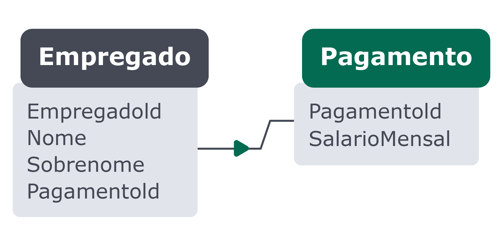
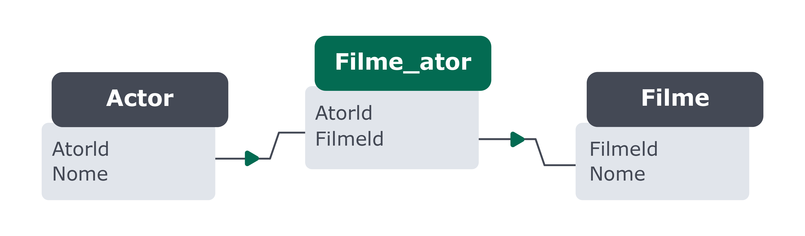
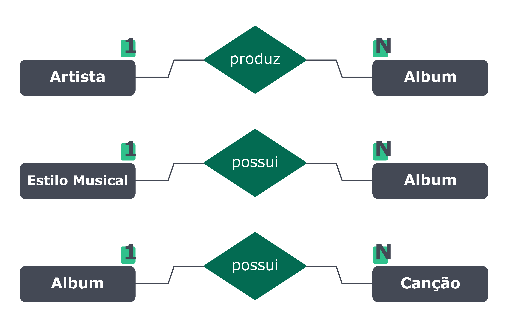
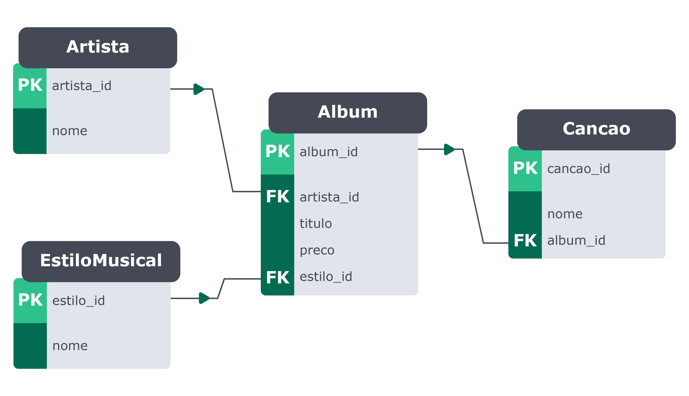

# Transformando ideias em um modelo de banco de dados

### Modelar um banco de dados:

**1 - Identificar as entidades , atributos e relacionamentos com base na descrição do problema;**
**Entidades:**
* São uma representação de algo do mundo real dentro do banco de dados. Elas normalmente englobam toda uma ideia e são armazenadas em formato de tabelas em um banco de dados.

**Atributos:**
* Os atributos são tudo aquilo que pode ser usado para descrever algo. Por exemplo, uma entidade pessoa pode ter nome, altura, peso e idade.

**Relacionamentos:**

* Os relacionamentos servem para representar como uma entidade deve estar ligada com outra(s) no banco de dados. Há três tipos de relacionamentos possíveis em um banco de dados, que são:

**Relacionamento Um para Um (1..1):**

_Exemplo de relacionamento um para um_ 
* Um empregado recebe um pagamento
---
**Relacionamento Um para Muitos ou Muitos para Um (1..N):**

_Exemplo de relacionamento um para muitos ou muitos para um_
* Uma categoria pode estar ligada a vários livros, embora um livro deva possuir apenas uma categoria.
---

**Relacionamento Muitos para Muitos (N..N):**

_Exemplo de relacionamento muitos para muitos_
* Um filme pode contar com vários atores e também que os atores podem atuar em vários filmes, surge a necessidade de um relacionamento muitos para muitos.

**Exemplo de como montar uma tabela similar a acima descrita:**
```sql
CREATE TABLE AnimalCuidador (
    cuidador_id INT NOT NULL,
    animal_id INT NOT NULL,
    CONSTRAINT PRIMARY KEY (cuidador_id , animal_id),
    FOREIGN KEY (cuidador_id)
        REFERENCES cuidador (cuidador_id),
    FOREIGN KEY (animal_id)
        REFERENCES animais (animal_id)
)  ENGINE=INNODB;
```

**2 -  Construir um diagrama entidade-relacionamento para representar as entidades encontradas no passo 1;**

Diagrama de relacionamento básico que demonstra como uma entidade é relacionada com a outra, usando o modelo EntidadeA + verbo + EntidadeB.

* Álbum: `album_id`, `titulo`, `preco`, `estilo_id` e `artista_id`;
* Artista: `artista_id` e `nome`;
* Estilo Musical: `estilo_id` e `nome`;
* Canção: `cancao_id`, `nome` e `album_id`.



_Relacionamento entre as entidades `Álbum`, `Artista`, `Estilo Musical` e `Canção`_
* Entender quantas vezes uma entidade pode se relacionar com uma outra, para, a partir disso, você poder criar esse primeiro diagrama;
---
* Montando um diagrama mais detalhado:

Relacionamento detalhado entre as tabelas `Artista`, `Album`, `EstiloMusical` e `Cancao`

**Relacionamentos presentes entre as tabelas acima:**
* Tabelas Artista e Album:

As tabelas Artista e Album possuem um relacionamento de um para muitos (1..N), em que um artista pode possuir um ou mais álbuns.

* Tabelas Album e Cancao:

A tabela Album possui um relacionamento de um para muitos com a tabela Cancao , uma vez que um álbum pode conter várias canções.

* Tabelas Album e EstiloMusical:

A tabela EstiloMusical também possui um relacionamento de um para muitos com a tabela Album , uma vez que um estilo musical pode estar contido em vários álbuns.

**3 - Criar um banco de dados para conter suas tabelas;**

**Principais tipos de dados no MySQL**:
* **BOOLEANOS:**
  * Pode receber 1 ou 0. O valor padrão é nulo.
  ```sql
  TINYINT(1)
  ```
* **CARACTERES:**
  * Tamanho fixo: **CHAR(5)** - Permite inserir até uma quantidade de caracteres e sempre ocupa todo o espaço reservado.
  * Tamanho variável: **VARCHAR(10)** - Permite inserir até uma quantidade que for definida, porém só ocupa o espaço que for preenchido.
* **NÚMEROS:**
  * Valores exatos inteiros: 
    * **TINYINT**: 0 a 255 **UNSIGNED** ou -128 a 127 **SIGNED**.
      * **UNSIGNED**: Permite armazenar somente valores positivos.
      * **SIGNED**: Permite armazenar valores positivos e negativos.
      _Possuem a mesma caracteristica do TINYINT_, as faixas de valores aumentam conforme o tipo utilizado:
    * **SMALLINT**
    * **MEDIUMINT**
    * **INT**
    * **BIGINT**
  * Valores exatos com precisão decimal:
    * **DECIMAL**: Permite definir quantidade máxima de números e sua precisão. EX: **DECIMAL(5,2)** = 199.99.
    * **FLOAT/REAL**: Tem a precisão de uma casa decimal. EX: 10.9.
    * **DOUBLE**: Tem a precisão de duas casas decimais. EX: 49.90.

* **TEMPORAIS:**
  * **DATE**: Armazena valores no padrão YYYY-MM-DD.
  * **TIME**: Armazena valores no padrão HH:MM:SS.
  * **YEAR**: Armazena somente o ano entre 1901 e 2155.
  * **DATETIME**: Junta o **DATE** e o **TIME** no padrão YYYY-MM-DD HH:MM:SS - faixa de valores : 1000-01-01 00:00:00 até 9999-12-31 23:59:59.
  * **TIMESTAMP**: Igual ao **DATETIME** mas também opera com base em fuso horário que pode ser definido no servidor. 
---

* Códigos para criação e gerenciamento de um banco de dados:

```sql
-- Cria um banco de dados com o nome especificado.
CREATE DATABASE nome_do_banco_de_dados;

-- Sinônimo de CREATE DATABASE, também cria um banco de dados.
CREATE SCHEMA nome_do_banco_de_dados;

-- Verifica se o banco de dados ainda não existe.
-- Essa verificação é comumente utilizada junto ao CREATE DATABASE para evitar
-- a tentativa de criar um banco de dados duplicado, o que ocasionaria um erro.
IF NOT EXISTS nome_do_banco_de_dados;

-- Lista todos os bancos de dados existentes.
SHOW DATABASES;

-- Define o banco de dados ativo para uso no momento.
USE nome_do_banco_de_dados;
```
**4 - Criar e modelar tabelas tendo o (diagrama ER) do passo 2 como base.**

* Cria a base de dados:
```sql
CREATE DATABASE IF NOT EXISTS albuns;
```

* Cria uma tabela:

```sql
USE albuns;

CREATE TABLE artista (
    artista_id INT PRIMARY KEY AUTO_INCREMENT,
    nome VARCHAR(50)
)  ENGINE=INNODB;
```

```sql
USE albuns;

CREATE TABLE estilomusical (
    estilo_id INT PRIMARY KEY AUTO_INCREMENT,
    nome VARCHAR(50) NOT NULL
)  ENGINE=INNODB;
```


```sql
USE albuns;

CREATE TABLE album (
    album_id INT PRIMARY KEY AUTO_INCREMENT,
    artist_id INT NOT NULL,
    titulo VARCHAR(100) NOT NULL,
    preco DECIMAL(5 , 2 ) NOT NULL,
    estilo_id INT NOT NULL,
    FOREIGN KEY (artist_id)
        REFERENCES artista (artista_id),
    FOREIGN KEY (estilo_id)
        REFERENCES estilomusical (estilo_id)
)  ENGINE=INNODB;
```

## Exercício: 

* Um zoológico precisa de um banco de dados para armazenar informações sobre os seus animais. As informações a serem armazenadas sobre cada animal são:
  * Nome;
  * Espécie;
  * Sexo;
  * Idade;
  * Localização. Cada animal também possui vários cuidadores, e cada cuidador pode ser responsável por mais de um animal. Além disso, cada cuidador possui um gerente, sendo que cada gerente pode ser responsável por mais de um cuidador. Siga os passos aprendidos no dia de hoje para modelar essa base de dados.

<iframe style="border:none" width="800" height="450" src="https://whimsical.com/embed/3t2yFRTKYFHxd4FaLXZydJ"></iframe>

# Normalização, Formas Normais e Dumps

* **1ª Forma Normal:**
  * Colunas devem possuir apenas um valor
  * Valores em uma coluna devem ser do mesmo tipo de dados
  * Cada coluna deve possuir um nome único
  * A ordem dos dados registrados em uma tabela não deve afetar a integridade dos dados.

* **2ª Forma Normal:**
  * A tabela deve estar na 1ª Forma Normal
  * A tabela não deve possuir dependências parciais.
  
Tabela intermediária:
Relação N:N


* **3ª Forma Normal:**
  * A tabela deve estar na 1ª e 2ª Formas Normais;
  * A tabela não deve conter atributos (colunas) que não sejam totalmente dependentes na PK (chave primária).

**Aprender a criar e restaurar backups usando o MySQL Workbench e também o comando dump**

* Para exportar schema e/ou dados:
1 - Escolha quais bancos de dados devem ser incluídos no backup;
2 - Escolha quais tabelas deve ser incluídas no backup;
3 - Escolha se Stored Procedures e Stored Functions devem ou não ser incluídas;
4 - Escolha se gostaria de exportar apenas estrutura ( Structure Only ), apenas os dados ( Data Only ) ou ambos ( Structure and Data );
5 - Escolha se gostaria de incluir os triggers no arquivo de backup;
6 - Escolha se gostaria de incluir o esquema (código para criar banco de dados. Ex.: CREATE DATABASE );
7 - Selecione o local para onde exportar o arquivo.

**pelo terminal**:

```sh
mysql -u danimuller20 -p
```

```sql
show databases;
```

```sql
use nome_da_base_de_dados;
```

```sql
show tables;
```

```sql
select * from nome_da_tabela
```

* **DUMP:**

Salva todos os dados
```sh
mysqldump _-u danimuller20 -p nome_da_base_de_dados > backupNome_da_base.sql
```

Salva apenas a estrutura do banco de dados
```sh
 mysqldump -u danimuller20 -p --no-data Escola > backupEscola.sq
```

Recuperar o banco de dados

```sh
mysql -u danimuller20 -p   
```

```sql
create database nome_do_banco;  
```

```sql
use nome_do_banco;  
```

```sh
 mysqldump -u danimuller20 -p nome_do_banco < nome_do_arquivo.sql 

```

# Transformando ideias em um modelo de banco de dados - Parte 2

**Clonar tabelas existentes;**
```sql
-- Sintaxe:
CREATE TABLE nome_para_nova_tabela LIKE tabela_a_ser_clonada;

-- Exemplo:
CREATE TABLE actor_clone LIKE sakila.actor;
```
* Esse comando não copia os dados, apenas a estrutura;
* Caso não especifique qual banco de dados utilizar, a nova tabela será inserida no banco que estiver ativo no momento da execução. Sendo assim, sempre especifique o banco de dados antes.

```sql
USE nome_do_banco_de_dados;
CREATE TABLE nome_para_nova_tabela LIKE tabela_a_ser_clonada;
```

**Lidar com VIEWs;**
O que a view permite:

* Ter uma tabela que pode ser usada em relatórios;
* Ter uma tabela para usar como base para montar novas queries;
* Reduzir a necessidade de recriar queries utilizadas com frequência.

Criação de uma view:
```sql
USE nome_do_banco_de_dados;
CREATE VIEW top_10_customers AS
    SELECT c.customer_id, c.first_name, SUM(p.amount) AS total_amount_spent
    FROM sakila.payment p
    INNER JOIN sakila.customer c ON p.customer_id = c.customer_id
    GROUP BY customer_id
    ORDER BY total_amount_spent DESC
    LIMIT 10;
```
Acessar a view:
```sql
SELECT * FROM top_10_customers;
```

Excluir uma view:
```sql
DROP VIEW nome_da_view;
```

**Alterar tabelas existentes;**
Tabela exemplo:

```sql
USE sakila;
CREATE TABLE noticia(
    noticia_id INT PRIMARY KEY,
    titulo VARCHAR(100),
    historia VARCHAR(300)
) engine = InnoDB;
```

Códigos para alterar uma tabela:
```sql
-- Adicionar uma nova coluna
ALTER TABLE noticia ADD COLUMN data_postagem date NOT NULL;

-- Modificar o tipo e propriedades de uma coluna
ALTER TABLE noticia MODIFY noticia_id BIGINT;

-- Adicionar incremento automático a uma coluna
-- (especifique o tipo da coluna + auto_increment)
ALTER TABLE noticia MODIFY noticia_id BIGINT auto_increment;

-- Alterar o tipo e nome de uma coluna
ALTER TABLE noticia CHANGE historia conteudo_postagem VARCHAR(1000) NOT NULL;

-- Dropar/Excluir uma coluna
ALTER TABLE noticia DROP COLUMN data_postagem;

-- Adicionar uma nova coluna após outra
ALTER TABLE noticia ADD COLUMN data_postagem DATETIME NOT NULL AFTER titulo;
```
Confirmar as alterações:
```sql
SHOW COLUMNS FROM sakila.noticia;
```
**Dropar - Deletar uma tabela;**

```sql
DROP TABLE nome_da_tabela;
```
* Não é possível dropar (excluir) uma tabela que é referenciada por uma restrição de chave estrangeira. A chave estrangeira ou a tabela que a contém deve ser excluída antes.
* **Integridade referencial:** Propriedade que afirma que todas as referências de chaves estrangeiras devem ser válidas.

**Usar um INDEX;**

* Tipos de index:
  * PRIMARY KEY;
  * UNIQUE;
  * INDEX;
  * FULLTEXT INDEX.

* Criar index em uma tabela existente:
```sql
CREATE INDEX nome_index ON tabela(coluna);

CREATE FULLTEXT INDEX nome_index ON tabela(coluna);
```

* Criar um index ao criar uma tabela:
```sql
CREATE DATABASE IF NOT EXISTS pizzaria;
USE pizzaria;

CREATE TABLE pizzas(
  pizza_id INT PRIMARY KEY,
  sabor VARCHAR(100),
  preco DECIMAL(5, 2 ),
  INDEX sabor_index(sabor)
)ENGINE=INNODB;
```

* Criar um index ao alterar uma tabela:
```sql
ALTER TABLE nome_tabela
ADD INDEX nome_index(nome_coluna);
```

* Pontos positivos do INDEX:
  * Acelera as queries SELECT;
  * Permite tornar uam coluna com valores únicos (UNIQUE);
  * Permite buscar em grandes pedaços  de textos (FULLTEXT INDEX);
  * Aceleram as operações de UPDATE que usam WHERE.

* Ponto negativos:
  * Ocupam espaço em disco;
  * Tornam lentas operações de INSERT, UPDATE e DELETE, porque cada índice precisa ser atualizado junto com os dados

**Quando não utilizar índices**

* Em tabelas pequenas, pois a diferença de performance será mínima, se houver;
* Em colunas que retornarão uma grande quantidade dados quando filtradas. Por exemplo, você não adicionaria os artigos "o" e "a" ao índice de um livro;
* Em tabelas que frequentemente têm atualizações em grande escala, uma vez que a performance dessas atualizações será afetada;
* Em colunas que são frequentemente manipuladas, haja vista que a manutenção do índice dessa coluna pode demandar muito tempo quando feita em excesso;
* Em colunas que possuem muitos valores nulos.