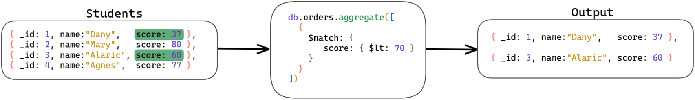
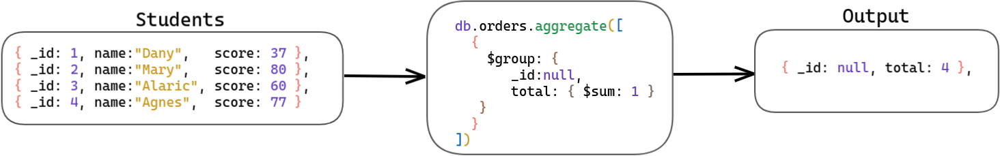
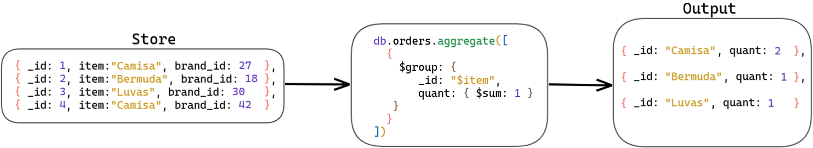

# Aggregation Framework - Parte 1

#### Aggregation Pipeline

Tendo a seguinte operação:
```js
db.orders.aggregate([
  { $match: { status: "A" } },
  { $group: { _id: "$cust_id", total: { $sum: "$amount" } } }
]);
```
Essa operação possui dois estágios:

**Primeiro Estágio:** O estágio ```$match``` filtra os documentos pelo campo ```status```, e passam para o próximo estágio somente os documentos que têm ```status``` igual a ```"A"```.

**Segundo Estágio:** O estágio ```$group``` agrupa os documentos pelo campo ```cust_id``` para calcular a soma dos valores do campo amount para cada ```cust_id``` único

[Aggregation Pipeline Operators](https://docs.mongodb.com/manual/reference/operator/aggregation/#aggregation-expression-operators)

#### Filtrar documentos com o estágio ```$match```

O estágio representado pelo operador ```$match```filtra os documentos da mesma maneira que os filtros no método ```find({ $match })```.



**Igualdade simples:**

```js
db.articles.aggregate(
  [{ $match : { author : "dave" } }]
);
```
A operação citada seleciona todos os documentos em que o campo author seja igual a dave . Note que a sintaxe do filtro é exatamente igual à utilizada como filtro no método find() . A agregação retornará os seguintes documentos:
```js
[
  {
    _id: ObjectId("512bc95fe835e68f199c8686"),
    author: 'dave',
    score: 80,
    views: 100
  },
  {
    _id: ObjectId("512bc962e835e68f199c8687"),
    author: 'dave',
    score: 85,
    views: 521
  }
]
```

**Igualdade complexa:**

É possível, dentro do match, utilizar operadores como or, and, in etc.

```js
db.articles.aggregate(
  [
    {
$match: {
$or: [
          { score: { $gt: 70, $lt: 90 } },
          { views: { $gte: 1000 } }
        ]
      }
    }
  ]
);
```

Nessa operação de agregação, o primeiro e único estágio seleciona todos os documentos da coleção articles em que o score seja maior que 70 e menor que 90 , ou o campo views seja maior ou igual a 1000:

```js
{ "_id" : ObjectId("512bc95fe835e68f199c8686"), "author" : "dave", "score" : 80, "views" : 100 }
{ "_id" : ObjectId("512bc962e835e68f199c8687"), "author" : "dave", "score" : 85, "views" : 521 }
{ "_id" : ObjectId("55f5a192d4bede9ac365b257"), "author" : "ahn", "score" : 60, "views" : 1000 }
{ "_id" : ObjectId("55f5a192d4bede9ac365b258"), "author" : "li", "score" : 55, "views" : 5000 }
{ "_id" : ObjectId("55f5a1d3d4bede9ac365b25b"), "author" : "ty", "score" : 95, "views" : 1000 }   
```

#### Limitar os resultados com ```$limit```

O operador ```$limit``` limita o número de documentos que será passado para o próximo estágio do pipeline. Ele sempre recebe um valor do tipo inteiro e positivo.

Retorna apenas 5 documentos:
```js
db.articles.aggregate(
  [
    { $limit : 5 }
  ]
);
```
**Exercícios de fixação:**

1 - Selecione todas as transações feitas pelo cliente chamado "Dave America":

```js
db.transactions.aggregate( [ { $match: {from: "Dave America"}}]);
```

2 - Selecione todas as transações com o valor entre 700 e 6000, ou que sejam recebidas pela cliente "Lisa Simpson":

```js
db.transactions.aggregate( [ { $match: { $or: [ { value: { $gt: 700, $lt: 6000 } }, { to: "Lisa Simpson" }] } }]);
```

3 - Selecione três transações com o valor acima de 1000:

```js
db.transactions.aggregate( [{ $match: {value: {$gt: 1000}}}, {$limit: 3}]);
```

#### Controlar a exibição de campos com o ```$project```

O operador ```$project``` tem como uma de suas funções passar adiante no pipeline apenas alguns campos dos documentos vindos do estágio anterior, fazendo isso por meio de uma "projeção", como no método ```find({}, { $project })```. Mas aqui temos uma diferença: esses campos podem ser novos, sendo resultado de um cálculo ou de uma concatenação.

Vamos ver alguns exemplos, considerando o documento abaixo: 
```js
db.books.insertOne(
  {
    _id: 1,
    title: "A Fundação",
    isbn: "0001122223334",
    author: { last: "Asimov", first: "Isaac" },
    copies: 5
  }
)
```

**Incluindo campos específicos:**
Inclui apenas os campos _id, title e author no documento de saída:

```js
db.books.aggregate(
  [
    {
$project : {
        title : 1,
        author : 1
      }
    }
  ]
);
```
Resultado:
```js
{
    _id: 1,
    title: 'A Fundação',
    author: { last: 'Asimov', first: 'Isaac' }
  }
```

** Excluindo o campo _id:**
O campo _id é padrão e é o único que necessita de uma negação explícita para que não seja incluído no documento de saída:
```js
db.books.aggregate([
  {
$project : {
      _id: 0,
      title : 1,
      author : 1
    }
  }
]);
```

**Excluindo outros campos:**

Quando você nega um campo específico, todos os outros serão incluídos no documento de saída:

```js
db.books.aggregate([
  {
$project : {
      copies: 0
    }
  }
]);
```

** Excluindo campos em sub-documentos:**
Para documentos embedados, seguimos os mesmos conceitos de dot notation:
```js
db.books.aggregate([
  {
$project : {
      "author.first": 0,
      copies: 0
    }
  }
]);
```

**Incluindo campos calculados:**

Podemos usar uma string iniciada com o caractere ```$``` para indicar que queremos projetar um campo, assim: ```"$nomeDoCampo"```.
A operação a seguir adiciona os novos campos isbn, lastname e copiesSold:

```js
db.books.aggregate([
  {
$project: {
      title: 1,
      isbn: {
        prefix: { $substr: ["$isbn", 0, 3] },
        group: { $substr: ["$isbn", 3, 2] },
        publisher: { $substr: ["$isbn", 5, 4] },
        title: { $substr: ["$isbn", 9, 3] },
        checkDigit: { $substr: ["$isbn", 12, 1] }
      },
      lastName: "$author.last",
      copiesSold: "$copies"
    }
  }
]);
```
resultado:
```js
{
  "_id" : 1,
  "title" : "A Fundação",
  "isbn" : {
    "prefix" : "000",
    "group" : "11",
    "publisher" : "2222",
    "title" : "333",
    "checkDigit" : "4"
  },
  "lastName" : "Asimov",
  "copiesSold" : 5
}
```
❗Lembre-se: esses novos campos são apenas adicionados para a visualização final, não serão salvos no banco❗

#### Fazer agrupamentos com o ```$group```

Este é provavelmente o operador que você mais utilizará nas operações de agregação. Com ele é possível agrupar valores de diversas formas, desde um "distinct" simples até cálculos mais elaborados com a ajuda de outros operadores.



O principal parâmetro do $group é o ```_id``` (que não tem nada a ver com o campo ```_id``` das coleções). Neste caso, ele é responsável por conter o campo ou os campos que serão utilizados no agrupamento.



No documento de saída, o _id contém um agrupamento exclusivo para cada valor. Esses documentos de saída também podem conter campos calculados , que conterão valores de alguma [expressão de acumulação](https://docs.mongodb.com/manual/reference/operator/aggregation/group/#accumulators-group).

**Operador de Acumulação:**

Operadores de acumulação mais utilizados:

* ```$addToSet```: retorna um array com os valores únicos da expressão para cada grupo;
* ```$avg```: retorna a média de valores numéricos. Valores não numéricos são ignorados;
* ```$first```: retorna um valor do primeiro documento de cada grupo;
* ```$last```: retorna um valor do último documento de cada grupo;
* ```$max```: retorna o maior valor de cada grupo;
* ```$sum```: retorna a soma de valores numéricos. Valores não numéricos são ignorados.

Vamos ver alguns exemplos, considerando o documento abaixo: 

```js
db.sales.insertMany([
{
  _id: 1,
  item: "Código Limpo",
  price: NumberDecimal("10"),
  quantity: NumberInt("2"),
  date: ISODate("2014-03-01T08:00:00Z")
},
{
  _id: 2,
  item: "O Homem e Seus Símbolos",
  price: NumberDecimal("20"),
  quantity: NumberInt("1"),
  date: ISODate("2014-03-01T09:00:00Z")
},
{
  _id: 3,
  item: "Comunicação Não-Violenta",
  price: NumberDecimal("5"),
  quantity: NumberInt( "10"),
  date: ISODate("2014-03-15T09:00:00Z")
},
{
  _id: 4,
  item: "Comunicação Não-Violenta",
  price: NumberDecimal("5"),
  quantity:  NumberInt("20"),
  date: ISODate("2014-04-04T11:21:39.736Z")
},
{
  _id: 5,
  item: "Código Limpo",
  price: NumberDecimal("10"),
  quantity: NumberInt("10"),
  date: ISODate("2014-04-04T21:23:13.331Z")
},
{
  _id: 6,
  item:"A Coragem de Ser Imperfeito",
  price: NumberDecimal("7.5"),
  quantity: NumberInt("5" ),
  date: ISODate("2015-06-04T05:08:13Z")
},
{
  _id: 7,
  item: "A Coragem de Ser Imperfeito",
  price: NumberDecimal("7.5"),
  quantity: NumberInt("10"),
  date: ISODate("2015-09-10T08:43:00Z")
},
{
  _id: 8,
  item: "Código Limpo",
  price: NumberDecimal("10"),
  quantity: NumberInt("5" ),
  date: ISODate("2016-02-06T20:20:13Z")
}
]);
```

**Contando o número de documentos:**
Você pode utilizar o operador $group para contar o número de documentos da coleção sales:

```js
db.sales.aggregate([
  {
$group: {
      _id: null,
      count: { $sum: 1 }
    }
  }
]);
```
 O ```_id``` está setado como null, porque nesse caso queremos todos os documentos. O retorno dessa operação é:

```js
{ "_id" : null, "count" : 8 }
```

**Retornando valores distintos:**
O operador ```$group``` também pode ser utilizado para encontrar os valores distintos de um campo. Por exemplo, se quiser saber todos os valores únicos do campo item e quantos são:

```js
db.sales.aggregate([
  {
$group : {
      _id : "$item",
      count: { $sum: 1}
    }
  }
]);
```
Note que o campo deve ser precedido de ```$```. O resultado da operação é:

```js
{ "_id" : "A Coragem de Ser Imperfeito", "count" : 2 }
{ "_id" : "O Homem e Seus Símbolos", "count" : 1 }
{ "_id" : "Código Limpo", "count" : 3 }
{ "_id" : "Comunicação Não-Violenta", "count" : 2 }
```
**Somando valores:**
Para saber o valor das vendas, você deve utilizar o operador ```$sum```, que, por sua vez, aceita mais modificadores. No exemplo que se segue, multiplica-se o valor do campo price pelo valor do campo quantity:

```js
db.sales.aggregate([
  {
$group : {
      _id : "$item",
      totalSaleAmount: {
$sum: {
$multiply: ["$price", "$quantity"]
        }
      }
    }
  }
]);
```

Resultado:
```js
{ "_id" : "A Coragem de Ser Imperfeito", "totalSaleAmount" : NumberDecimal("112.5") }
{ "_id" : "O Homem e Seus Símbolos", "totalSaleAmount" : NumberDecimal("20") }
{ "_id" : "Código Limpo", "totalSaleAmount" : NumberDecimal("170") }
{ "_id" : "Comunicação Não-Violenta", "totalSaleAmount" : NumberDecimal("150") }
```

**Having (do Mysql), combinando estágios no aggregate:**
Também é possível realizar operações equivalentes ao HAVING do SQL, que nada mais é que um filtro depois de um agrupamento. Por exemplo, se você quiser manter o agrupamento anterior, mas saber apenas as vendas que possuem valores maiores do que 100, é só adicionar mais um estágio no pipeline:

```js
db.sales.aggregate([
  // Primeiro Estágio
  {
$group: {
      _id : "$item",
      totalSaleAmount: {
$sum: {
$multiply: ["$price", "$quantity"]
        }
      }
    }
  },
  // Segundo Estágio
  {
$match: { "totalSaleAmount": { $gte: 100 } }
  }
]);
```

Resultado:
```js
{ "_id" : "A Coragem de Ser Imperfeito", "totalSaleAmount" : NumberDecimal("112.5") }
{ "_id" : "Código Limpo", "totalSaleAmount" : NumberDecimal("170") }
{ "_id" : "Comunicação Não-Violenta", "totalSaleAmount" : NumberDecimal("150") }
```

**Agrupando por null:**

Você pode executar operações matemáticas em todos os documentos de uma coleção. Basta passar ```null``` no ```_id``` e seguir com os operadores de acumulação.

No exemplo a seguir, a operação de agregação retornará um documento com o valor total da venda, a quantidade média de itens vendidos e o total de vendas:

```js
db.sales.aggregate([
  {
$group : {
      _id : null,
      totalSaleAmount: {
$sum: { $multiply: ["$price", "$quantity"] }
      },
      averageQuantity: { $avg: "$quantity" },
      count: { $sum: 1 }
    }
  }
]);
```

Resultado:
```js
{
  "_id" : null,
  "totalSaleAmount" : NumberDecimal("452.5"),
  "averageQuantity" : 7.875,
  "count" : 8
}
```

**Exercícios de fixação:**

1 - Selecione todos os bancos, ou seja, valores do campo bank:
```js
db.transactions.aggregate([ { $group: { _id: "$bank" } }]);
```

2 - Selecione o valor total das transações em cada banco e quantas são:
```js
db.transactions.aggregate([ { $group: { _id: "$bank", totalValueOfAllTransactions: {$sum: "$value"}, count: {$sum: 1 }} }]);
```

3 - Selecione o valor total de transações:
```js
db.transactions.aggregate([ { $group: { _id: null, totalValueOfAllTransactions: {$sum: "$value"}}}]);
```

4 - Selecione os bancos que têm o valor total de transações maior que 1000:
```js
db.transactions.aggregate([ { $group: { _id: "$bank", totalValueOfAllTransactions: {$sum: {$multiply: "$value"}}}}, {$match: {"totalValueOfAllTransactions": {$gt: 1000}}}]);
```

#### Trabalhar com arrays com o ```$unwind```

O operador $unwind "desconstrói" um campo array do documento de entrada e gera como saída um documento para cada elemento do array. Cada documento de saída é o documento de entrada com o valor do campo array substituído por um elemento do array.

Na prática fica mais fácil de entender. Insira o seguinte documento na coleção inventory:

```js
db.inventory.insertOne({ _id: 7, item: "ABC1", sizes: ["S", "M", "L"] });
```

E agora, utilizando o $unwind como um estágio do pipeline :
```js
db.inventory.aggregate([{ $unwind : "$sizes" }]);
```

Resultado:
```js
{ "_id" : 7, "item" : "ABC1", "sizes" : "S" }
{ "_id" : 7, "item" : "ABC1", "sizes" : "M" }
{ "_id" : 7, "item" : "ABC1", "sizes" : "L" }
```
Temos a "expansão" do array sizes, e a saída são três documentos com os valores _id e item preservados.

#### Juntar dados de uma ou mais coleções com o ```$lookup```

O operador ```$lookup``` foi introduzido na versão 3.2 do MongoDB e vem evoluindo desde então. Com ele, é possível juntar documentos de outra coleção (join). Como resultado dessa junção, um elemento do tipo array é adicionado a cada documento da coleção de entrada, contendo os documentos que deram "match" na coleção com a qual se faz o "join".

Existem quatro parâmetros básicos para montar um ```$lookup```:

* ```from```: uma coleção no mesmo database para executar o ```join```;
* ```localField```: o campo da coleção de onde a operação de agregação está sendo executada. Será comparado por igualdade com o campo especificado no parâmetro foreingField;
* ```foreingField```: o campo da coleção especificada no parâmetro from que será comparado com o campo localField por igualdade simples;
* ```as```: o nome do novo array que será adicionado.

**Join com igualdade simples:**

Considere os seguintes documentos nas coleções orders e inventory:
```js
// orders
db.orders.insertMany([
{ _id: 1, item: "almonds", price: 12, quantity: 2 },
{ _id: 2, item: "pecans", price: 20, quantity: 1 },
{ _id: 3 }
]);
```

```js
// inventory
db.inventory.insertMany([
{ _id: 1, sku: "almonds", description: "product 1", instock: 120 },
{ _id: 2, sku: "bread", description: "product 2", instock: 80 },
{ _id: 3, sku: "cashews", description: "product 3", instock: 60 },
{ _id: 4, sku: "pecans", description: "product 4", instock: 70 },
{ _id: 5, sku: null, description: "Incomplete" },
{ _id: 6 }
]);
```

Imagine que você queria retornar em uma única query os documentos correspondentes das duas coleções mencionadas. A primeira coisa é encontrar um campo em comum entre elas. Nesse caso, seriam os campos item (coleção orders) e sku (coleção inventory ). Quando cruzados na operação a seguir, um novo campo, chamado inventory_docs , será adicionado ao resultado final:

```js
db.orders.aggregate([
  {
$lookup: {
      from: "inventory",
      localField: "item",
      foreignField: "sku",
      as: "inventory_docs"
    }
  }
]);
```

Resultado:
```js
{
  "_id" : 1,
  "item" : "almonds",
  "price" : 12,
  "quantity" : 2,
  "inventory_docs" : [
    {
      "_id" : 1,
      "sku" : "almonds",
      "description" : "product 1",
      "instock" : 120
    }
  ]
}
{
  "_id" : 2,
  "item" : "pecans",
  "price" : 20,
  "quantity" : 1,
  "inventory_docs" : [
    {
      "_id" : 4,
      "sku" : "pecans",
      "description" : "product 4",
      "instock" : 70
    }
  ]
}
{
  "_id" : 3,
  "inventory_docs" : [
    {
      "_id" : 5,
      "sku" : null,
      "description" : "Incomplete"
    },
    {
      "_id" : 6
    }
  ]
}
```

**Exercícios de fixação:**

Utilizando o banco de dados agg_example, adicione a seguinte collection e faça os exercícios:
```js
db.clients.insertMany([
  { name: "Dave America", State: "Florida" },
  { name: "Ned Flanders", State: "Alasca" },
  { name: "Mark Zuck", State: "Texas" },
  { name: "Edna Krabappel", State: "Montana" },
  { name: "Arnold Schuz", State: "California" },
  { name: "Lisa Simpson", State: "Florida" },
  { name: "Barney Gumble", State: "Texas" },
  { name: "Homer Simpson", State: "Florida" },
]);
```

1 - Selecione todos os clientes com as suas respectivas transações feitas:
```js
db.clients.aggregate([
  {
$lookup: {
      from: "transactions",
      localField: "name",
      foreignField: "from",
      as: "transactions_docs"
    }
  }
]);
```

2 - Selecione quatro clientes com as suas respectivas transações recebidas:
```js
db.clients.aggregate([
  {
$lookup: {
      from: "transactions",
      localField: "name",
      foreignField: "to",
      as: "transactions_docs"
    }
  },
  {$limit: 4}
]);
```

3 - Selecione todos os cliente do estado da "Florida" e suas respectivas transações recebidas:
```js
db.clients.aggregate([
  {
    $match: {State: "Florida"}
  },
  {
    $lookup: {
      from: "transactions",
      localField: "name",
      foreignField: "to",
      as: "transactions_docs"
    }
  }
]);
```

# Aggregation Framework - Parte 2

#### Aplicando condições ao Join com ```$lookup```

Parâmetros opcionais:

* ```let```: define as variáveis que serão utilizadas no estágio pipeline dentro do ```$lookup```. É necessário porque o estágio pipeline não consegue acessar diretamente os campos dos documentos de entrada, então esses campos precisam ser definidos previamente e transformados em variáveis;

* ```pipeline```: define as condições ou o pipeline que será executado na coleção de junção. Se você quiser todos os documentos da coleção de junção, é só especificá-lo como vazio (```[]```).

Considere os seguintes documentos na coleção orders:
```js
{ _id: 1, item: "almonds", price: 12, ordered: 2 },
{ _id: 2, item: "pecans", price: 20, ordered: 1 },
{ _id: 3, item: "cookies", price: 10, ordered: 60 }
```

E os seguintes documentos na coleção warehouses:
```js
{ _id: 1, stock_item: "almonds", warehouse: "A", instock: 120 },
{ _id: 2, stock_item: "pecans", warehouse: "A", instock: 80 },
{ _id: 3, stock_item: "almonds", warehouse: "B", instock: 60 },
{ _id: 4, stock_item: "cookies", warehouse: "B", instock: 40 },
{ _id: 5, stock_item: "cookies", warehouse: "A", instock: 80 }
```

A operação a seguir junta todos os documentos da coleção **orders** com a coleção **warehouse** através do campo ```item``` se a quantidade em estoque (```instock```) for suficiente para cobrir a quantidade vendida (```ordered```). Os documentos que dão match são colocados no campo ```stockdata```.
```js
db.orders.aggregate([
  {
    $lookup: {
      from: "warehouses",
      let: { order_item: "$item", order_qty: "$ordered" },
      pipeline: [
        {
          $match: {
            $expr: {
              $and: [
                { $eq: [ "$stock_item",  "$$order_item" ] },
                { $gte: [ "$instock", "$$order_qty" ] }
              ]
            }
          }
        },
        { $project: { stock_item: 0, _id: 0 } }
      ],
      as: "stockdata"
    }
  }
]);
```

Dentro do estágio pipeline, temos um operador ```$match``` que utiliza uma expressão (```$expr```). Esta, por sua vez, utiliza o operador ```$and```. Dentro do ```$and```, são utilizados operadores de igualdade (```$eq```) e de comparação (```$gte```). O símbolo ```$``` é utilizado para se referir aos campos da coleção **warehouse** (a coleção de junção), enquanto ```$$``` se refere às variáveis definidas no estágio ```let``` (os campos da coleção orders). Os campos ```_id``` e ```stock_item``` da coleção de join (**warehouse**) são excluídos com o uso do operador ```$project```.

Como resultado, os documentos abaixo serão retornados:

```js
{
  "_id" : 1,
  "item" : "almonds",
  "price" : 12,
  "ordered" : 2,
  "stockdata" : [
    {
      "warehouse" : "A",
      "instock" : 120
    },
    {
      "warehouse" : "B",
      "instock" : 60
    }
  ]
}
{
  "_id" : 2,
  "item" : "pecans",
  "price" : 20,
  "ordered" : 1,
  "stockdata" : [
    {
      "warehouse" : "A",
      "instock" : 80
    }
  ]
}
{
  "_id" : 3,
  "item" : "cookies",
  "price" : 10,
  "ordered" : 60,
  "stockdata" : [
    {
      "warehouse" : "A",
      "instock" : 80
    }
  ]
}
```

**Exercícios de fixação**

Utilizando o banco de dados agg_example , adicione a seguinte collection e faça os exercícios:

1 - Selecione todos os clientes com as suas respectivas transações feitas;
```js
db.clients.aggregate([
   { $lookup: {
     from: "transactions",
     let: { client_to: "$to", client_from: "$from" }, pipeline: [
       { $match: {
         $expr: {
           $eq: ["$&client_to", "$$client_from"] } 
          } }, 
           { $project: { _id: 0, to: 1 } }
      ], as: "transactions_ok" } }
]);
```

2 - Selecione quatro clientes com as suas respectivas transações recebidas;     
```js
db.clients.aggregate([
   { $lookup: {
     from: "transactions",
     let: { client_to: "$to", client_from: "$from" }, pipeline: [
       { $match: {
         $expr: {
           $eq: ["$&client_to", "$$client_from"] } 
          } }, 
           { $project: { _id: 0, from: 1 } }
      ], as: "transactions_ok" } }
]);
```

3 - Selecione todos os cliente do estado da "Florida" e suas respectivas transações recebidas.
```js
```

### Executando operações de soma e subtração de valores em um pipeline

#### Expressão ```$add```

Com a expressão $add , é possível somar valores numéricos ou datas. Se um dos argumentos for do tipo ```date```, o outro argumento será tratado como milissegundos e adicionado à data.

Considere os seguintes documentos na coleção sales:

```js
{ _id: 1, item: "abc", price: 10, fee: 2, date: ISODate("2014-03-01T08:00:00Z") },
{ _id: 2, item: "jkl", price: 20, fee: 1, date: ISODate("2014-03-01T09:00:00Z") },
{ _id: 3, item: "xyz", price: 5,  fee: 0, date: ISODate("2014-03-15T09:00:00Z") }
```

Utilizando a expressão ```$add``` no estágio ```$project```, você pode criar um novo campo com o valor total somando os campos **price** e **fee**:
```js
db.sales.aggregate([
  { $project: { item: 1, total: { $add: ["$price", "$fee"] } } }
]);
```

Resultado:
```js
{ "_id" : 1, "item" : "abc", "total" : 12 }
{ "_id" : 2, "item" : "jkl", "total" : 21 }
{ "_id" : 3, "item" : "xyz", "total" : 5 }
```

Para valores do tipo **date**, um dos argumentos sempre será tratado como milissegundos. Imagine que você queira adicionar 3 dias ao valor do campo **date**. Você consegue fazer de duas maneiras. A primeira é passar em um dos argumentos o número equivalente a 3 dias em milissegundos ( 2,592e+8 ). A segunda é criar uma expressão que devolva esse número:

```js
db.sales.aggregate([
  { $project: { item: 1, billing_date: { $add: ["$date", 2.592e+8] } } }
]);
```
ou
```js
db.sales.aggregate([
  { $project: { item: 1, billing_date: { $add: ["$date", 3 * 24 * 60 * 60000] } } }
]);
```

Resultado:
```js
 {
    _id: 1,
    item: 'abc',
    billing_date: ISODate("2014-03-04T08:00:00.000Z")
  },
  {
    _id: 2,
    item: 'jkl',
    billing_date: ISODate("2014-03-04T09:00:00.000Z")
  },
  {
    _id: 3,
    item: 'xyz',
    billing_date: ISODate("2014-03-18T09:00:00.000Z")
  }

```

#### Expressão ```$subtract```

Com a expressão ```subtract```, podemos subtrair dois valores numéricos para retornar a diferença entre eles, ou duas datas para retornar a diferença entre elas em milissegundos. **O segundo argumento sempre será subtraído do primeiro**.

Considere os seguintes documentos na coleção **sales**:

```js
{
  _id: 1,
  item: "abc",
  price: 10,
  fee: 2,
  discount: 5,
  date: ISODate("2014-03-01T08:00:00Z")
},
{
  _id: 2,
  item: "jkl",
  price: 20,
  fee: 1,
  discount: 2,
  date: ISODate("2014-03-01T09:00:00Z")
}
```

Em uma única operação no estágio ```$project```, podemos montar uma expressão um pouco mais complexa, utilizando ```$add``` para calcular o total e o ```$subtract``` para aplicar um desconto no subtotal:

```js
db.sales.aggregate([
  {
$project: {
      item: 1,
      total: {
$subtract: [
          { $add: ["$price", "$fee"] },
          "$discount"
        ]
      }
    }
  }
]);
```

Observe que um dos argumentos do $subtract é o resultado de uma expressão (```$add```) que soma dois campos da coleção (**price e fee**). O segundo argumento (valor a ser subtraído) recebe o campo ```$discount```. Os seguintes documentos serão retornados:

```js
{ "_id" : 1, "item" : "abc", "total" : 7 }
{ "_id" : 2, "item" : "jkl", "total" : 19 }
```

É possível subtrair duas datas também. A operação a seguir utiliza a expressão ```$subtract``` para subtrair o valor do campo date da data corrente, utilizando a variável de sistema **NOW** (disponível a partir da versão 4.2 do MongoDB) e retorna a diferença em milissegundos:

```js
db.sales.aggregate([
  {
$project: {
      item: 1,
      dateDifference: {
$subtract: ["$$NOW", "$date"]
      }
    }
  }
]);
```

Alternativamente, você pode utilizar a função **Date()** para obter a data corrente:
```js
db.sales.aggregate([
  {
$project: {
      item: 1,
      dateDifference: {
$subtract: [new Date(), "$date"]
      }
    }
  }
]);
```

Você também pode utilizar milissegundos como argumento da subtração. A operação seguinte subtrai 5 minutos do campo date:
```js
db.sales.aggregate([
  {
$project: {
      item: 1,
      dateDifference: {
$subtract: ["$date", 5 * 60 * 1000]
      }
    }
  }
]);
```
#### Expressão ```$ceil```

A expressão $ceil basicamente arredonda o número especificado para "cima". Ela executa a função matemática teto que converte um número x no número inteiro mais próximo, que seja maior ou igual a x.

Considere os seguintes documentos na coleção samples:

```js
{ _id: 1, value: 9.25 },
{ _id: 2, value: 8.73 },
{ _id: 3, value: 4.32 },
{ _id: 4, value: -5.34 }
```

A operação a seguir utiliza a expressão $ceil no estágio $project para retornar um novo campo chamado ceilingValue:

```js
db.samples.aggregate([
  { $project: { value: 1, ceilingValue: { $ceil: "$value" } } }
]);
```

Resultado:
```js
{ "_id" : 1, "value" : 9.25, "ceilingValue" : 10 }
{ "_id" : 2, "value" : 8.73, "ceilingValue" : 9 }
{ "_id" : 3, "value" : 4.32, "ceilingValue" : 5 }
{ "_id" : 4, "value" : -5.34, "ceilingValue" : -5 }
```

#### Expressão ```$floor```

Já a expressão ```$floor``` retorna o maior número inteiro menor ou igual ao número especificado, ou seja, faz um arredondamento para baixo.

```js
{ _id: 1, value: 9.25 },
{ _id: 2, value: 8.73 },
{ _id: 3, value: 4.32 },
{ _id: 4, value: -5.34 }
```

Se você aplicar a expressão $floor no estágio $project :
```js
db.samples.aggregate([
  { $project: { value: 1, floorValue: { $floor: "$value" } } }
]);
```

Resultado:
```js
{ "_id" : 1, "value" : 9.25, "floorValue" : 9 }
{ "_id" : 2, "value" : 8.73, "floorValue" : 8 }
{ "_id" : 3, "value" : 4.32, "floorValue" : 4 }
{ "_id" : 4, "value" : -5.34, "floorValue" : -6 }
```

#### Expressão ```$round```

A expressão ```$round``` retorna o número inteiro mais próximo do valor atual e também permite definir a quantidade de casas decimais que você quer manter ao arredondar.

```js
{ _id: 1, value: 9.25 },
{ _id: 2, value: 8.73 },
{ _id: 3, value: 4.32 },
{ _id: 4, value: -5.34 }
```

Se você aplicar a expressão ```$rournd``` no estágio ```$project```:
```js
db.samples.aggregate([
  { $project: { value: 1, roundedValue: { $round: ["$value"] } } }
]);
```

Resultado:
```js
{ "_id" : 1, "value" : 9.25, "roundedValue" : 9 }
{ "_id" : 2, "value" : 8.73, "roundedValue" : 9 }
{ "_id" : 3, "value" : 4.32, "roundedValue" : 4 }
{ "_id" : 4, "value" : -5.34, "roundedValue" : -5 }
```

#### Expressão ```$abs```

A expressão $abs retorna o [valor absoluto de um número](https://en.wikibooks.org/wiki/Arithmetic/Absolute_Values).

Considere os seguintes documentos na coleção ratings :

```js
{ _id: 1, start: 5, end: 8 },
{ _id: 2, start: 4, end: 4 },
{ _id: 3, start: 9, end: 7 },
{ _id: 4, start: 6, end: 7 }
```

Aplicando a expressão ```$abs``` combinada com a expressão ```$subtract``` no estágio ```$project```, podemos retornar a diferença entre os valores dos campos **start** e **end**:

```js
db.ratings.aggregate([
  {
$project: {
      delta: {
$abs: { $subtract: ["$start", "$end"] }
      }
    }
  }
]);
```

Resultado:
```js
{ "_id" : 1, "delta" : 3 }
{ "_id" : 2, "delta" : 0 }
{ "_id" : 3, "delta" : 2 }
{ "_id" : 4, "delta" : 1 }
```

#### Expressão ```$multiply```

A expressão ```$multiply``` multiplica dois valores numéricos. Esses valores devem ser passados num array, como nas outras expressões anteriores.

Considere os seguintes documentos na coleção **sales**:

```js
{ _id: 1, item: "abc", price: 10, quantity: 2, date: ISODate("2014-03-01T08:00:00Z") },
{ _id: 2, item: "jkl", price: 20, quantity: 1, date: ISODate("2014-03-01T09:00:00Z") },
{ _id: 3, item: "xyz", price: 5, quantity: 10, date: ISODate("2014-03-15T09:00:00Z") }
```

Na agregação a seguir, utilizamos o ```$multiply``` no estágio ```$project``` para projetar um novo campo chamado **total**, que conterá o valor da **multiplicação** entre os campos **price e quantity**:

```js

db.sales.aggregate([
  {
$project: {
      date: 1,
      item: 1,
      total: {
$multiply: ["$price", "$quantity"]
      }
    }
  }
]);
```

Resultado:
```js
{ "_id" : 1, "item" : "abc", "date" : ISODate("2014-03-01T08:00:00Z"), "total" : 20 }
{ "_id" : 2, "item" : "jkl", "date" : ISODate("2014-03-01T09:00:00Z"), "total" : 20 }
{ "_id" : 3, "item" : "xyz", "date" : ISODate("2014-03-15T09:00:00Z"), "total" : 50 }
```

#### Expressão ```$divide```

A expressão ```$divide```, como o próprio nome sugere, divide dois valores. O primeiro argumento é o dividendo, e o segundo é o divisor.

Considere os seguintes documentos na coleção planning:

```js
{ _id: 1, name: "A", hours: 80, resources: 7 },
{ _id: 2, name: "B", hours: 40, resources: 4 }
```

A agregação abaixo utiliza o ```$divide``` para **dividir** o valor do campo **hours por 8** e calcular o número de dias de trabalho (**workdays**):

```js
db.planning.aggregate([
  {
$project: {
      name: 1,
      workdays: {
$divide: ["$hours", 8]
      }
    }
  }
]);
```

Resultado:
```js
{ "_id" : 1, "name" : "A", "workdays" : 10 }
{ "_id" : 2, "name" : "B", "workdays" : 5 }
```

#### Estágio ```$addFields```

O ```$addFields``` é um estágio que adiciona novos campos aos documentos. A saída desse estágio conterá todos os campos existentes nos documentos de entrada e adicionará os novos campos especificados.

Você pode incluir subdocumentos ou arrays de subdocumentos, utilizando o conceito de dot notation . Um pipeline pode conter mais de um estágio ```$addFields```.

Considere os documentos abaixo na coleção scores:

```js
{
  _id: 1,
  student: "Maya",
  homework: [10, 5, 10],
  quiz: [10, 8],
  extraCredit: 0
},
{
  _id: 2,
  student: "Ryan",
  homework: [5, 6, 5],
  quiz: [8, 8],
  extraCredit: 8
}
```

A operação de agregação abaixo utiliza o $addFields duas vezes para incluir três novos campos nos documentos de saída:

```js
db.scores.aggregate([
  {
addFields: {
      totalHomework: { $sum: "$homework" } ,
      totalQuiz: { $sum: "$quiz" }
    }
  },
  {
addFields: {
      totalScore: {
add: [ "$totalHomework", "$totalQuiz", "$extraCredit" ]
      }
    }
  }
]);
```

O primeiro estágio adiciona o campo **totalHomework** somando os valores contidos no array **homework**. Também adiciona outro campo chamado **totalQuiz** somando os valores do array **quiz**.

O segundo estágio adiciona o campo **totalScore**, que, por sua vez, soma os valores dos campos **totalHomework**, **totalQuiz** e **extraCredit**.

Note que o resultado mantém os campos originais do documento de entrada, juntamente com os três novos campos adicionados:

```js
{
  "_id" : 1,
  "student" : "Maya",
  "homework" : [ 10, 5, 10 ],
  "quiz" : [ 10, 8 ],
  "extraCredit" : 0,
  "totalHomework" : 25,
  "totalQuiz" : 18,
  "totalScore" : 43
}
{
  "_id" : 2,
  "student" : "Ryan",
  "homework" : [ 5, 6, 5 ],
  "quiz" : [ 8, 8 ],
  "extraCredit" : 8,
  "totalHomework" : 16,
  "totalQuiz" : 16,
  "totalScore" : 40
}
```
