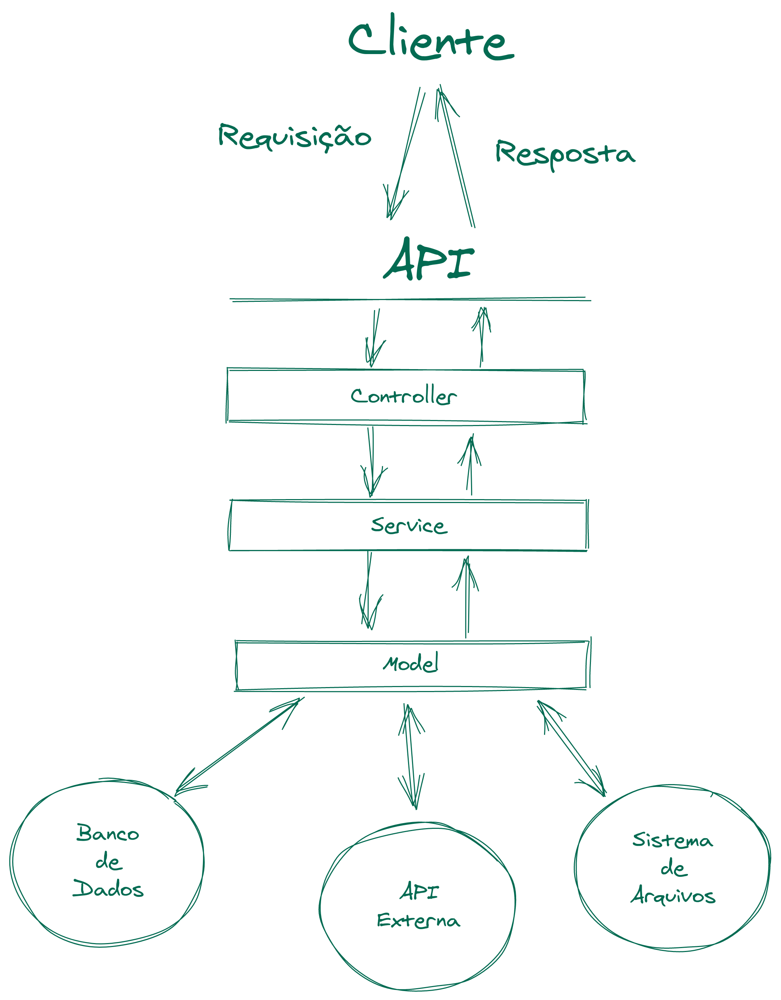

### As camadas de Controller e Service

Essas duas camadas são, respectivamente, responsáveis por (1) receber e tratar os dados da requisição e (2) aplicar as regras de negócio da aplicação antes que qualquer comunicação com o banco seja realizada. Dessa forma, o Model precisa fazer menos coisas, o que quer dizer que temos uma arquitetura que delimita mais as responsabilidades de cada camada, de forma que, caso precisemos alterar uma parte do código, a quantidade de lugares em que precisaremos mexer é menor, visto que camada tem sua responsabilidade bem delimitada.



_Organização das Camadas_

### A camada dos Controllers

A camada dos controllers é a primeira camada numa API. É nela onde os dados da requisição serão recebidos e tratados, pra depois serem passados para as próximas camadas.

O controller recebe as requisições e então consulta o service, enviando na resposta aquilo que o service retornar, que pode ser uma mensagem de erro, em caso de falha, ou as informações pedidas, em caso de sucesso.

Ao se comunicar com o service, o controller deve passar apenas as informações necessárias, sendo assim não é uma boa prática passar toda a request para o service, as informações devem ser extraídas e então apenas o que for necessário para determinada ação deve ser transferido.

### A camada dos Services

Ela fica situada entre as camadas de controller e model e é responsável pela nossa lógica de negócio. O modelo, então, passa a ser responsável somente pelo acesso a dados.

Você pode ver isso de outra forma: para evitar que o modelo fique grande demais, ele é quebrado em duas outras camadas, cada uma com parte da responsabilidade.

Uma boa camada de serviço:

* Deve centralizar acesso a dados e funções externas. Exemplo: chamar um evento que dispara uma mensagem no Slack;

* Deve abstrair lógica de negócio complexa do seu modelo;

* Não deve ter nenhum tipo de informação sobre o acesso a camada de dados. Exemplo: não ter nenhuma query SQL;

* Não deve receber nada relacionado ao HTTP, seja o request ou o response. O controller deve mandar apenas o necessário para o service.

### Praticando

Crie os arquivos abaixo numa pasta chamada hello-msc:
```json
// hello-msc/package.json

{
  "name": "hello-msc",
  "version": "0.0.1",
  "description": "",
  "main": "index.js",
  "scripts": {
    "start": "node index.js",
    "dev": "nodemon index.js"
  },
  "keywords": [],
  "author": "Tryber",
  "license": "GPL-3.0",
  "dependencies": {
    "body-parser": "^1.19.0",
    "express": "^4.17.1",
    "express-rescue": "^1.1.31",
    "joi": "^17.4.0",
    "mongodb": "^3.6.4",
    "nodemon": "^2.0.7"
  }
}
```

```js
// hello-msc/index.js

const express = require('express');
const bodyParser = require('body-parser');

const Author = require('./models/Author');

const app = express();

app.use(bodyParser.json());

app.get('/authors', async (_req, res) => {
  const authors = await Author.getAll();

  res.status(200).json(authors);
});

app.get('/authors/:id', async (req, res) => {
  const { id } = req.params;

  const author = await Author.findById(id);

  if (!author) return res.status(404).json({ message: 'Not found' });

  res.status(200).json(author);
});

app.post('/authors', async (req, res) => {
  const { first_name, middle_name, last_name } = req.body;

  if (!Author.isValid(first_name, middle_name, last_name)) {
    return res.status(400).json({ message: 'Dados inválidos' });
  }

  await Author.create(first_name, middle_name, last_name);

  res.status(201).json({ message: 'Autor criado com sucesso! ' });
});

const PORT = process.env.PORT || 3000;

app.listen(PORT, () => {
  console.log(`Ouvindo a porta ${PORT}`);
});
```

Crie uma pasta models e dentro dela o arquivo os seguintes arquivos:

```js
// hello-msc/models/connection.js

const { MongoClient } = require('mongodb');

const OPTIONS = {
  useNewUrlParser: true,
  useUnifiedTopology: true,
}

const MONGO_DB_URL = 'mongodb://127.0.0.1:27017';

let db = null;

const connection = () => {
  return db
    ? Promise.resolve(db)
    : MongoClient.connect(MONGO_DB_URL, OPTIONS)
    .then((conn) => {
      db = conn.db('model_example');
      return db;
    })
};

module.exports = connection;
```

```js
// hello-msc/models/Author.js

const connection = require('./connection');
const { ObjectId } = require('mongodb');

// Cria uma string com o nome completo do autor

const getNewAuthor = (authorData) => {
const { id, firstName, middleName, lastName } = authorData;

const fullName = [firstName, middleName, lastName]
  .filter((name) => name)
  .join(' ');

return {
  id,
  firstName,
  middleName,
  lastName,
  name: fullName,
 };
};

// Busca todos os autores do banco.

const getAll = async () => {
  return connection()
    .then((db) => db.collection('authors').find().toArray())
    .then((authors) =>
      authors.map(({ _id, firstName, middleName, lastName }) =>
        getNewAuthor({
          id: _id,
          firstName,
          middleName,
          lastName,
        })
      )
  );
}

/*
Busca um autor específico, a partir do seu ID
@param {String} id ID do autor a ser recuperado
*/
const findById = async (id) => {
  if (!ObjectId.isValid(id)) {
    return null;
  }

  const authorData = await connection()
    .then((db) => db.collection('authors').findOne(new ObjectId(id)));

  if (!authorData) return null;

  const { firstName, middleName, lastName } = authorData;

  return getNewAuthor({ id, firstName, middleName, lastName });
};

const isNonEmptyString = (value) => {
  if (!value) return false;

  return typeof value === 'string';
};

const isValid = (firstName, middleName, lastName) => {
  if (middleName && typeof middleName !== 'string') return false;

  return isNonEmptyString(firstName) && isNonEmptyString(lastName);
};

const create = async (firstName, middleName, lastName) =>
  connection()
    .then((db) => db.collection('authors').insertOne({ firstName, middleName, lastName }))
    .then(result => getNewAuthor({ id: result.insertedId, firstName, middleName, lastName }));

module.exports = {
  getAll,
  findById,
  isValid,
  create,
};
```

Por último, execute npm install dentro da pasta hello-msc para instalar as dependências.

Agora temos uma aplicação na qual as regras de negócio dizem respeito todas ao formato dos campos na entidade Author. Por exemplo: "Nome de ser uma string e não pode ser vazio". No entanto, para ilustrar melhor o tipo de regra de negócio que costuma ser tratada pelo service, vamos introduzir uma nova regra: "Um autor com mesmo nome completo não pode ser cadastrado duas vezes."

Essa é uma regra mais complexa, que exige mais lógica do que um simples if para ser validada. Sendo assim, é o tipo de regra que se encaixa perfeitamente no service que vamos criar agora!

Crie a pasta services e dentro dela o arquivo Authors.js , adicione o código abaixo no arquivo:

```js
const Author = require('../models/Author');

const getAll = async () => Author.getAll();

const findById = async (id) => Author.findById(id);

const create = async (firstName, middleName, lastName) =>
  Author.create(firstName, middleName, lastName);

module.exports = {
  getAll,
  findById,
  create,
};
```

Até agora, nosso service realiza todas as três operações que o model também realiza, sem nenhuma lógica adicional. Repare como, em cada função, nós apenas retornamos uma chamada para aquela mesma função dentro do model.

Primeiro, vamos precisar de uma função no nosso model que nos permita buscar autores pelos três nomes. Isso vai permitir a implementação da regra "Um autor com mesmo nome completo não pode ser cadastrado duas vezes."

Altere o arquivo hello-msc/models/Author.js da seguinte maneira:

```js
// hello-msc/models/Author.js

/* ... */

// const create = async (firstName, middleName, lastName) =>
//   connection()
//     .then((db) => db.collection('authors').insertOne({ firstName, middleName, lastName }))
//     .then(result => getNewAuthor({ id: result.insertedId, firstName, middleName, lastName }));

const findByName = async (firstName, middleName, lastName) => {
  // Determinamos se devemos buscar com ou sem o nome do meio
  const query = middleName
    ? { firstName, middleName, lastName }
    : { firstName, lastName };

  // Executamos a consulta e retornamos o resultado
  const author = await connection()
    .then((db) => db.collection('authors').findOne(query));

  // Caso nenhum author seja encontrado, devolvemos null
  if (!author) return null;

  // Caso contrário, retornamos o author encontrado
  return getNewAuthor(author);
};

// module.exports = {
//   getAll,
//   findById,
//   isValid,
//   create,
     findByName
// };
```

Com essa função pronta, precisamos modificar o service para que ele a utilize e aplique nossa regra de negócio. Modifique o arquivo services/Author.js da seguinte forma:

```js
// const Author = require('../models/Author');

// const getAll = async () => Author.getAll();

// const findById = async (id) => Author.findById(id);

// const create = async (firstName, middleName, lastName) =>
//   Author.create(firstName, middleName, lastName);

const create = async (firstName, middleName, lastName) => {
  // Buscamos um autor com o mesmo nome completo que desejamos criar
  const existingAuthor = await Author.findByName(firstName, middleName, lastName);

  // Caso esse autor já exista, retornamos um objeto de erro informando
  // que não é possível criar o autor pois ele já existe
  if (existingAuthor) {
    return {
      error: {
        code: 'alreadyExists',
        message: 'Um autor já existe com esse nome completo',
      },
    };
  }

  // Caso o autor não exista e, portanto, possa ser criado
  // chamamos o model e retornamos o resultado
  return Author.create(firstName, middleName, lastName);
};

// module.exports = {
//   getAll,
//   findById,
//   create,
// };
```

Agora, nosso service implementa a regra de negócio mais complexa que temos. Isso até poderia acontecer no model mas, com o tempo, o model começaria a acumular várias funções, indo desde validar dados e regras de negócio até montar queries complexas e comunicar com o banco. Deixando as duas coisas em camadas separadas é como se tanto model quanto service tivessem "espaço pra crescer" sem ficarem "apertados".

Existe ainda uma outra regra que é responsabilidade do service e que, até o momento, tem ficado no middleware: identificar e gerar erros.

Devemos codificar nossas aplicações de forma que erros não previstos sejam evitados ou contornados. No entanto, existem erros que derivam de regras de negócio que não foram atendidas. Vamos chamar esses erros de Erros de domínio. Numa aplicação em camadas, eles servem principalmente para que camadas inferiores possam informar camadas superiores sobre erros ou falhas que, por sua vez, devem ser retornadas a quem fez a chamada.

No nosso caso, temos um exemplo de erro de domínio, com o código alreadyExists . O service retorna esse objeto de erro para que o controller saiba que ocorreu um erro e que o autor não foi criado com sucesso. e que permite que o controller saiba que o status da requisição não deve ser 200, por exemplo. Outro tipo de situação conhecida que deve ser notificada pelo service é quando um item buscado não é encontrado. Note, na linha 23 do index.js , que quem faz esse tratamento até agora é o middleware. Vamos mudar isso!

Altere o arquivo services/Author.js
```js
// hello-msc/services/Author.js

// const Author = require('../models/Author');

// const getAll = async () => Author.getAll();

const findById = async (id) => {
  // Solicitamos que o model realize a busca no banco
  const author = await Author.findById(id);

  // Caso nenhum autor seja encontrado, retornamos um objeto de erro.
  if (!author) {
    return {
      error: {
        code: 'notFound',
        message: `Não foi possível encontrar um autor com o id ${id}`,
      },
    };
  }

  // Caso haja um autor com o ID informado, retornamos esse autor
  return author;
};

// const create = async (firstName, middleName, lastName) => {
//   // Buscamos um autor com o mesmo nome completo que desejamos criar
//   const existingAuthor = await Author.findByName(firstName, middleName, lastName);

//   // Caso esse autor já exista, retornamos um objeto de erro informando
//   // que não é possível criar o autor pois ele já existe
//   if (existingAuthor) {
//     return {
//       error: {
//         code: 'alreadyExists',
//         message: 'Um autor já existe com esse nome completo',
//       },
//     };
//   }

//   // Caso o autor não exista e, portanto, possa ser criado
//   // chamamos o model e retornamos o resultado
//   return Author.create(firstName, middleName, lastName);
// };

// module.exports = {
//   getAll,
//   findById,
//   create,
// };
```

Agora sim, nosso service está comunicando ao controller toda vez que algum erro de domínio acontece. A seguir, vamos ver como esse erro é recebido e tratado pelo controller.

Crie a pasta controllers e, dentro dela, o arquivo Author.js . Nesse arquivo, vamos implementar lógica para realizar todas as operações que nossa aplicação realiza até agora, começando por buscar todos os autores:

```js
// hello-msc/controllers/Author.js

const rescue = require('express-rescue');
const service = require('../services/Author');

const getAll = rescue(async (req, res) => {
  const authors = await service.getAll();

  res.status(200).json(authors);
});

module.exports = {
  getAll,
};
```

Repare que o código aqui é precisamente o mesmo que passamos ao registrar o endpoint GET /authors no index.js , e essa é a grande jogada!

A camada de controllers é responsável por receber e tratar as requests, e, no express, é composta majoritariamente de middlewares. Sendo assim, para construir nosso controller, só precisamos trazer os middlewares do index.js para o controller, alterando-os para que utilizem o service ao invés do model. Parece bastante coisa? Não se preocupe, vamos fazer middleware a middleware.

Já trouxemos o endpoint GET /authors , então vamos para o próximo: GET /authors/:id:

```js
// hello-msc/controllers/Author.js

// const rescue = require('express-rescue');
// const service = require('../services/Author');

// const getAll = rescue(async (req, res) => {
//   const authors = await service.getAll();

//   res.status(200).json(authors);
// });

const findById = rescue(async (req, res, next) => {
  // Extraímos o id da request
  const { id } = req.params;

  // Pedimos para o service buscar o autor
  const author = await service.findById(id);

  // Caso o service retorne um erro, interrompemos o processamento
  // e inicializamos o fluxo de erro
  if (author.error) return next(author.error);

  // Caso não haja nenhum erro, retornamos o author encontrado
  res.status(200).json(author);
});

// module.exports = {
//   getAll,
     findById,
// };
```

Repare que o controller verifica se existe um erro e, se existir, chama next(author.error) . Isso faz com que esse objeto de erro vá parar no próximo middleware de erro registrado. Isso quer dizer que podemos utilizar um middleware de erro centralizado também para nossos erros de domínio. Vamos ver como fazer isso logo mais. Por hora, vamos trazer a terceira e última função: a criação de um novo autor. Aqui veremos mais uma funcionalidade do controller em ação: a validação dos dados da request.

Você pode estar se perguntando "Ué, mas por que não validar no model?". O fato é que a validação no model pode trazer algumas dificuldades à medida que nossa aplicação escala, por exemplo:

* Nem sempre queremos validar os mesmos campos (uma request de edição pode pedir dados diferentes de uma request de criação, por exemplo);

* Estamos delegando mais uma responsabilidade para o model: além de se comunicar com o banco, ele também faz validação de requests;

* Ao validar no model, estamos validando os dados no final da request, ou seja, na saída . Ao validar no controller, estamos validando esses dados na entrada , garantindo que não vamos realizar nenhum processamento desnecessário utilizando dados que não são válidos, e que os dados vão trafegar limpinhos por todas as camadas da aplicação.

Dito isso, vamos usar uma biblioteca que vai nos ajudar muito: o Joi. Dá uma olhada:

Primeiro, vamos instalar o joi . Execute no terminal:
```sh
npm i joi
```

Agora, vamos adicioná-lo ao controller:
```js
// hello-mvc/controllers/Author.js

const Joi = require('joi');

/* ... */

// const findById = rescue(async (req, res, next) => { /* ... */ }

const create = rescue(async (req, res, next) => {
  // Utilizamos o Joi para descrever o objeto que esperamos
  // receber na requisição. Para isso, chamamos Joi.object()
  // passando um objeto com os campos da requisição e suas descrições
  const { error } = Joi.object({
    // Deve ser uma string (.string()) não vazia (.not().empty()) e é obrigatório (.required())
    firstName: Joi.string().not().empty().required(),
    // Não é obrigatório mas, caso seja informado, deve ser uma string não vazia
    middleName: Joi.string().not().empty(),
    // Deve ser uma string não vazia e é obrigatório
    lastName: Joi.string().not().empty().required(),
  })
    // Por fim, pedimos que o Joi verifique se o corpo da requisição se adequa a essas regras
    .validate(req.body);

  // Caso exista algum problema com a validação, iniciamos o fluxo de erro e interrompemos o middleware.
  if (error) {
    return next(error);
  }

  // Caso não haja erro de validação, prosseguimos com a criação do usuário
  const { firstName, middleName, lastName } = req.body;

  const newAuthor = await service.create(firstName, middleName, lastName);

  // Caso haja erro na criação do autor, iniciamos o fluxo de erro
  if (newAuthor.error) return next(newAuthor.error);

  // Caso esteja tudo certo, retornamos o status 201 Created, junto com as informações
  // do novo autor
  return res.status(201).json(newAuthor);
});

// module.exports = {
//   getAll,
//   findById,
     create,
// };
```

Agora que nosso controller está pronto, só falta "plugá-lo" no nosso app do express, no arquivo index.js.

Altere o arquivo index.js
```js
// hello-msc/index.js

// const express = require('express');
// const bodyParser = require('body-parser');

const Author = require('./controllers/Author');

// const app = express();

// app.use(bodyParser.json());

app.get('/authors', Author.getAll);
app.get('/authors/:id', Author.findById);
app.post('/authors', Author.create);

// const PORT = process.env.PORT || 3000;

// app.listen(PORT, () => {
//   console.log(`Ouvindo a porta ${PORT}`);
// });
```

No nosso controller, existem alguns momentos em que interrompemos o fluxo comum do middleware, e inciamos o fluxo de erro. Esse fluxo de erro é também responsabilidade da camada de controller, que deve converter o erro em um formato padronizado e enviá-lo, junto com o status code adequado, para o client que realizou a requisição.

Para implementar esse comportamento, vamos criar um middleware de erro . Para esse exemplo, vamos criá-lo numa pasta middlewares , mas é comum que o middleware de erro seja criado como um ErrorController, dentro da pasta controllers. Não há nada de errado com essa abordagem, e as duas são formas válidas de implementar.

Crie a pasta middlewares e, dentro dela, o arquivo error.js:

```js
// hello-msc/middlewares/error.js
module.exports = (err, req, res, _next) => {
  // Qualquer erro será recebido sempre por esse middleware, então a primeira coisa que fazemos
  // é identificar qual o tipo do erro.

  // Se for um erro do Joi, sabemos que trata-se de um erro de validação
  if (err.isJoi) {
    // Logo, respondemos com o status 400 Bad Request
    return res.status(400)
      // E com a mensagem gerada pelo Joi
      .json({ error: { message: err.details[0].message } });
  }

  // Caso não seja um erro do Joi, pode ser um erro de domínio ou um erro inesperado.
  // Construímos, então, um mapa que conecta um erro de domínio a um status HTTP.
  const statusByErrorCode = {
    notFound: 404, // Erros do tipo `notFound` retornam status 404 Not Found
    alreadyExists: 409, // Erros do tipo `alreadyExists` retornam status 409 Conflict
    // Podemos adicionar quantos códigos novos desejarmos
  };

  // Buscamos o status adequado para o erro que estamos tratando.
  // Caso não haja um status para esse código, assumimos que é
  // um erro desconhecido e utilizamos o status 500 Internal Server Error
  const status = statusByErrorCode[err.code] || 500;

  // Por último, retornamos o status e a mensagem de erro para o client
  res.status(status).json({ error: { message: err.message } });
};
```
Agora, é só "plugar" nosso middleware de erro na aplicação do express e pronto!

Volte no index.js e faça as seguintes adições.

```js
// hello-msc/index.js

// const express = require('express');
// const bodyParser = require('body-parser');

// const Author = require('./controllers/Author');
const errorMiddleware = require('./middlewares/error');

// const app = express();

// app.use(bodyParser.json());

// app.get('/authors', Author.getAll);
// app.get('/authors/:id', Author.findById);
// app.post('/authors', Author.create);

app.use(errorMiddleware);

// const PORT = process.env.PORT || 3000;

// app.listen(PORT, () => {
//   console.log(`Ouvindo a porta ${PORT}`);
// });
```

E, agora sim, nossa aplicação está pronta! Utilizando as três camadas: Model, Service e Controllers.

Dessa forma, fica muito mais fácil realizar alterações nessa aplicação, principalmente se ela for crescer, como a maioria das aplicações acaba crescendo

#### Boas Práticas em Arquitetura de Software

Indiferente de qual padrão arquitetural você vai usar, existem algumas boas práticas que você deve sempre manter em mente, independente do padrão a ser seguido.

#### Pense antes de escrever código!

A primeira coisa é você entender qual é o problema que será resolvido e, a partir daí, começar a pensar em uma solução em nível de arquitetura.

____
**Imagine o seguinte cenário:**
_"Quero criar uma aplicação que mostra todas as fotos que as pessoas tiraram com base na localização. As versões mobile native e web serão parecidas, mas apenas a mobile poderá tirar fotos."_ - Cliente, Seu.
____

Beleza! Pensando que vamos ter múltiplos clientes com funcionalidades semelhantes, faz sentido termos uma API, certo?

Pensando mais a fundo na arquitetura da API, é de se imaginar que vamos ter que subir as fotos em algum serviço de hospedagem (em vez de armazená-las nós mesmos), e vamos salvar no banco apenas a URL gerada após o upload . Nesse caso, faz bastante sentido termos uma camada de serviço que vai orquestrar essa parte de hospedagem.

#### Pense em Componentes

A intenção é que nossas aplicações sejam construídas com pequenos pedacinhos de código sem dependências entre si. A mesma coisa se aplica numa API também!

Dentro das suas camadas, mantenha cada controller, cada model e cada serviço pequeno e o mais desacoplado possível das outras partes. Faça com que eles se comuniquem somente através de interfaces muito bem definidas. Não deixe que um componente acesse diretamente o que está dentro de outro. Isso vai facilitar muito na hora de dar manutenção, reutilizar e testar seu código.

#### Mantenha suas pastas organizadas

Existem algumas maneiras de organizar as pastas em um projeto, mas vamos citar duas: por domínio/correlação e por papel técnico.

* Por domínio/correlação , nós mantemos todos os arquivos que têm relação com um Author , por exemplo, na mesma pasta, independente da responsabilidade de cada arquivo:

```
└── author
│   ├── authorController.js
│   ├── authorService.js
│   └── authorModel.js
└── book
│   └── bookController.js
│   └── bookService.js
│   └── bookModel.js
```

* Por papel técnico é como temos exemplificado até agora (não que seja necessariamente melhor). Todos os controllers em uma pasta, todos os services em outra e por aí vai:
```
└── controllers
│   ├── authorController.js
│   └── bookController.js
└── services
│   ├── authorService.js
│   └── bookService.js
└── models
│   ├── authorModel.js
│   └── bookModel.js
```

Muitas vezes, você vai utilizar um framework em que essa decisão já foi tomada. Nesse caso, siga com o padrão.

#### Mantenha o Express o mais longe possível

O mais longe possível quer dizer que devemos criar fronteiras bem definidas entre o Express e o "resto da sua aplicação".

Isso significa manter os objetos req e res dentro do escopo do controller e nunca passá-los inteiros para as partes do app que cuidam da lógica de negócio.

Tomando essa precaução simples, você vai evitar ficar criando mocks para esses objetos quando for escrever testes unitários, por exemplo.

Se o seu modelo precisa apenas dos campos user e password para fazer o login de alguém, para que passar para ele o objeto req e mandar todos os headers que vieram na requisição?

Observe este exemplo:

```js
const userController = async (req, res) => {
  try {
    // ruim 😧
    await UserService.create(req);

    // bom! 😊
    const { email, password } = req.body;
    await UserService.create(email, password);

    res.send({ message: 'Tudo certo!' });
  } catch (e) {
    res.status(500).send({ message: 'Algo deu errado' });
  }
};
```

Usando essas fronteiras como exemplo, nada além da camada de controle deveria saber que o Express existe.

#### Mantenha sua configuração separada (e segura)

Nos exemplos de aula, vimos que as informações sensíveis, como credenciais de acesso ao banco de dados, estavam todas expostas no nosso código.

Só fizemos isso para fins didáticos. Uma ótima prática é usar variáveis de ambiente para controlar coisas relacionadas à configuração geral da sua aplicação (em qual banco se conectar, para qual URL apontar etc.). Variáveis de ambiente são variáveis que podem ser definidas no sistema operacional e, portanto, podem ser diferentes para cada ambiente (computador). Por exemplo, no seu computador local, a URL do banco é uma, mas, no servidor da aplicação, a URL do banco é outra. Para fazer isso funcionar, você pode utilizar uma variável de ambiente chamada DB_URL e utilizar valores diferentes para ela no servidor e na sua máquina local.

**OK, e como eu acesso essa variável no código?**

O ambiente Node tem uma variável global que se chama process ; dentro dela temos um objeto env que armazena os valores de todas as variáveis de ambiente definidas no sistema operacional.
Podemos setar variáveis de ambiente pelo terminal:
```sh
DB_URL="mongodb://localhost:27017" node index.js
```

```js
// index.js

console.log(process.env.DB_URL) // mongodb://localhost:27017
```

No entanto, uma forma melhor e mais fácil, quando temos muitas variáveis, é criar um arquivo .env na raiz do projeto e usar a biblioteca dotenv, que basicamente pega o conteúdo desse arquivo e o deixa acessível via process.env.

```sh
npm install dotenv
```

```
# .env
PORT=3000
DB_URL=mongodb://localhost:27017
DB_NAME=model_example
```

```js
// index.js

require('dotenv').config();
// ...

const PORT = process.env.PORT;
app.listen(PORT, () => console.log(`Server listening on port ${PORT}`));
// Server listening on port 3000
```

```js
// models/connection.js
const mongoClient = require('mongodb').MongoClient;

const connection = () => {
  return mongoClient
    .connect(process.env.DB_URL, {
      useNewUrlParser: true,
      useUnifiedTopology: true,
    })
    .then((conn) => conn.db(process.env.DB_NAME))
    .catch((err) => {
      console.error(err);
      process.exit(1);
   });
};

module.exports = connection;
```

Por último, não se esqueça de colocar o .env no .gitignore, pois não vamos querer versionar esse arquivo.

Dessa forma, as configurações da sua aplicação podem mudar de acordo com o ambiente, ou até mesmo com o tempo ficam separadas do código, que é o mesmo em qualquer ambiente. Além disso, você não estará mais adicionando dados sensíveis ao seu repositório, visto que o arquivo .env contém esses valores e não será versionado.

```js
```
