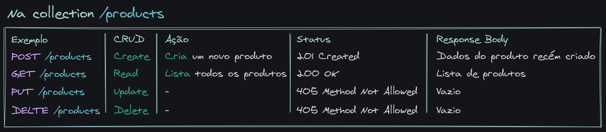
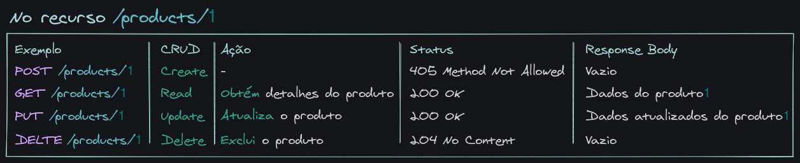

## REST

O REST é um conjunto de boas práticas. Quando você está construindo uma API, existem algumas normas que você deve seguir para ser "educado" (RESTful).
Para o REST, uma aplicação é um conjunto de recursos que podem ter seu estado representado de alguma forma. Ao consumir esses recursos, você está transferindo as informações sobre esse estado para o cliente (uma requisição `GET`, por exemplo) ou fazendo uma alteração nele (um `POST`, `PUT` ou `DELETE`). Daí o nome Transferência de Estado Representacional, ou seja, estamos transferindo uma representação do estado de algum recurso.

## Mas o que é um Recurso, afinal?
Um recurso, em REST, é uma abstração da informação.
Qualquer coisa que possa ser nomeada pode ser um recurso. Por exemplo:

* Usuários;
* Produtos;
* Compras;
* Etc.

Todos os exemplos acima podem ser considerados recursos.

No universo de Star Wars existem vários planetas. Na [SWAPI](https://swapi.dev/), podemos chamar um endpoint para listar todos os planetas ou apenas um. Nesse caso, um planeta é um recurso, e planetas é uma coleção de recursos.

## As 6 restrições para ser RESTful

A arquitetura REST define seis restrições, chamadas **constraints**, que devem ser respeitadas para que sua API seja RESTful.

### 1 - Interface uniforme (Uniform Interface)

A interface de comunicação entre seu servidor e seu cliente deve ser definida e seguida à risca, através de um padrão, para que ela se mantenha consistente. Dessa forma, essa "constraint", se seguida à risca, simplifica e desacopla a sua arquitetura.
Essa interface inclui o endpoint , o tipo de retorno e o uso dos verbos HTTP.

#### Recursos e coleções
O recurso a ser acessado/alterado deve ser identificado pelo endpoint da requisição. Exemplo: https://swapi.dev/api/planets/:id . Nessa URL, vemos que o recurso que queremos acessar, planet , é facilmente identificado.
Usar plural ou singular? Não importa. O importante é manter o padrão.

#### Tipo do retorno

Talvez você já tenha visto um header chamado `Content-type` nas respostas de requisições. Ele serve para dizer, para o nosso cliente, que tipo de conteúdo estamos retornando.

Se estamos retornando um JSON, enviamos o header como Content-type: `application/json`. Se fosse HTML, seria Content-type: `text/html`, e por aí vai.
Alguns formatos comuns são `JSON`, `XML` e `JavaScript`.

Esse tópico é, literalmente, sobre manter esses retornos consistentes. Se o cliente pede ou envia informação no formato `JSON`, você deve processar e retornar mantendo o formato `JSON`. Se um erro em um endpoint retorna os campos `code`, `error` e `message`, todos os erros devem retornar, pelo menos, esses campos. Se uma requisição ao endpoint de uma coleção (`GET /posts`, por exemplo), retorna um Array, todos os endpoints de coleção devem retornar Arrays. Se, por exemplo, quando realizamos uma requisição `GET /products`, recebemos um array de produtos, ao realizar a requisição `GET /sales`, não devemos receber um `JSON` no formato `{ "sales": [{ ... }] }`, já que esse comportamento é inconsistente com o do endpoint `GET /products`.

Dessa forma, ao consumir um endpoint da sua API, é possível até mesmo deduzir o comportamento dos demais endpoints, dispensando "tentativa e erro".


#### Ações/Verbos

A ação que vamos realizar no recurso deve ser identificada pelo verbo HTTP da requisição. Para o REST, os principais verbos HTTP são POST, GET, PUT e DELETE, e cada um realiza uma ação, dependendo se for enviado para o endpoint de um recurso ou de uma coleção.

As tabelas abaixo relacionam cada verbo com sua ação em caso de coleções ou recursos:



_Verbos HTTP e ações em coleções REST_



_Verbos HTTP e ações em recursos REST_

#### Respostas

Respostas são sempre obrigatórias. Nunca deixe seu cliente sem resposta, mesmo que ela não tenha um corpo.

Existem boas práticas em relação aos `status code` que nosso servidor envia como resposta. Temos uma variedade de códigos que devemos utilizar em situações específicas:

* 1xx: Informação;
* 2xx: Sucesso;
* 3xx: Redirecionamento;
* 4xx: Erro do cliente;
* 5xx: Erro no servidor.

[Códigos de status de respostas HTTP](https://developer.mozilla.org/pt-BR/docs/Web/HTTP/Status)

### 2 - Arquitetura cliente-servidor

Você já ouviu falar muito de arquitetura cliente-servidor, não é? De termos uma API e um cliente desacoplados? É exatamente o que o REST prega.

Não importa quem é nosso cliente, as nossas APIs têm que conseguir retornar dados para ele. O cliente pode ser um app mobile, web, tv, arduíno etc.

Imagine como seria se o Mercado Livre não tivesse um padrão na API deles. Seria um caos para conseguir integrar no front-end que estávamos construindo.

O princípio básico aqui é a separação de responsabilidades em duas partes. O cliente se preocupa com a exibição dos dados, experiência do usuário etc. O servidor se preocupa com armazenamento e acesso dos dados, cache, log e por aí vai.

Isso permite que as duas partes se desenvolvam de forma independente. Você pode trocar o cliente ou adicionar um novo sem mudar nada no servidor. Você pode mover o servidor para uma outra plataforma, escalá-lo etc. Pode até mesmo mudar completamente sua arquitetura interna, desde que a API que você fornece para seus clientes não mude (endpoint, resposta etc.).

### 3 - Sem estado (Stateless)

Essa constraint é um pouco mais complicada, mas nós temos um bom exemplo no React! Lembra-se quando criamos componentes que não tinham estado, e apenas recebiam props?

Esse é um dos conceitos mais importantes do REST. Ele que vai tornar possível nossa API responder a múltiplos clientes.

Não manter estado significa que toda requisição deve conter todas as informações necessárias (ser autossuficiente) para nossa API realizar uma ação . Desse jeito, não podemos reutilizar nenhum contexto que está armazenado no servidor (uma variável, por exemplo).

Exemplo:

* Em um app em que você faz uma requisição para se logar, o servidor inicia sua sessão e te retorna um token.

* Na próxima requisição, você precisa enviar o token novamente, pois o servidor "não se lembra" de você.

Esse ponto é importante, pois nos dá alguns benefícios:

* **Transparência**: facilita o trabalho do lado do servidor, pois todas as informações necessárias já estão na requisição;

* **Escalabilidade**: sem precisar manter estado, nosso servidor pode desalocar recursos que foram alocados para realizar uma ação específica e alocá-los apenas quando necessário.

### 4 - Cacheable

Primeiro, precisamos saber o que é `cache`. Cache é simplesmente um "depósito de informações". O exemplo mais próximo disso é quando seu navegador armazena imagens e arquivos para não precisar pedi-los para o servidor novamente toda vez que você revisitar uma página.
Esse cache é feito no lado do cliente, no browser.

O princípio aqui é que as respostas dadas pela nossa API devem dizer, explicitamente, se podem ou não ser cacheadas e por quanto tempo. Com isso, evita-se que clientes forneçam respostas "velhas" ou inapropriadas.

Vale ressaltar que o cache deve ser usado sabiamente. Usá-lo demais faz sua API perder a confiabilidade, e usá-lo de menos pode sobrecarregar seu servidor desnecessariamente.

No HTTP, o cache é definido pelo header `Cache-Control: max-age=120`. Nesse caso, o cliente "cacheia" a resposta da requisição por 120 segundos. Durante esse tempo, o cliente fornecerá a resposta cacheada, sem precisar consultar o servidor.

### 5 - Sistema em camadas (Layered System)

No caso do REST, essa divisão em camadas não tem nada a ver com a organização do nosso código diretamente. Esse princípio é sobre abstrair do cliente as camadas necessárias para responder a uma requisição.

Não importa se voce tem uma "API A" que se comunica com a "API B" que se comunica com uma fila ou um arquivo num "local C", ou se consulta um banco de dados, ou se esse banco de dados é local ou está armazenado em outro lugar. Quem consome a API não precisa saber de onde essas coisas estão vindo. Só precisa receber a resposta esperada.

### 6 - Código sob demanda (Code on Demand)

Esse princípio consiste em dar a possibilidade de o nosso servidor enviar código (JavaScript, por exemplo) ao nosso cliente, onde será executado. Assim, você consegue customizar o comportamento do cliente.

Um exemplo prático: enviar um "widget" para colocar na página um chat para que o cliente possa conversar com alguém.

Você não precisa implementar código sob demanda para ser RESTful, logo esse item é considerado opcional.

## REST no Express

De maneira geral, usar o Express ou qualquer outro framework não deve fazer muita diferença. Os princípios devem ser seguidos independente da tecnologia que você usar na implementação da sua API. Ela pode ser escrita em Node.js, em Python, em Perl, tanto faz.

Uma das vantagens de se usar o Express para construção de APIs é a organização das rotas. Podemos definir N controllers (funções callback que lidam com as requisições) para a mesma rota, separando-as apenas pelo verbo HTTP da requisição.

Além disso, é simples retornar um formato específico solicitado pelo cliente, da mesma maneira que é simples retornar um status HTTP.

```js
app.route('/user')
  .get((req, res) => {
    // Realiza uma operação
    res.status(401).send({
      message: 'Usuário não autorizado'
    })
  })
  .post(...)
  .put(...)
  .delete(...)
```

## Consumindo APIs

Para mantermos um ambiente familiar, vamos utilizar a biblioteca `node-fetch`, que implementa, no Node.JS todas as funcionalidades do `fetch` que você usa no navegador. Neste exemplo, vamos consumir a [Postman Echo API](https://learning.postman.com/docs/developer/echo-api/), que é uma API mantida pelo Postman para fins de aprendizagem. Ela simplesmente retorna para nós tudo o que enviamos para ela.

Vamos começar criando nosso pacote Node.js e instalando o `node-fetch`. Faremos isso numa nova pasta chamada `hello-http-methods`.

Dentro da pasta `hello-http-methods` execute o seguinte comando no terminal:
```sh
npm init -y && npm i node-fetch
```

Agora, crie o arquivo index.js , onde vamos escrever nosso código:
```js
// index.js

const fetch = require('node-fetch');

// Para aquecer, vamos começar com uma requisição do tipo `GET`
fetch('https://postman-echo.com/get?param1=teste')
  .then((response) => {
    // Ao receber a resposta, verificamos se correu tudo bem
    if (!response.ok) {
      // Caso não, forçamos a Promise a ser rejeitada
      return Promise.reject(response);
    }

    // Caso esteja tudo OK, lemos o body como JSON
    return response.json();
  })
  .then((data) => {
    // Por fim, escrevemos o body no console
    console.log(data);
  })
  .catch((errorOrResponse) => {
    // Em caso de falha simples (a request completou com um status diferente de 2xx)
    // simplesmente logamos o status no console
    if (errorOrResponse.status) {
      return console.error(`Request failed with status ${errorOrResponse.status}`);
    }

    // Caso tenha acontecido um erro de rede (não foi possível completar a request)
    // logamos o erro todo
    console.error(errorOrResponse);
  });
```

Executando o código acima, temos o seguinte resultado no terminal:
```sh
{
  args: { param1: 'teste' },
  headers: {
    'x-forwarded-proto': 'https',
    'x-forwarded-port': '443',
    host: 'postman-echo.com',
    'x-amzn-trace-id': 'Root=1-6048162b-72d5940c2e1fce1c1bd9ece7',
    accept: '*/*',
    'user-agent': 'node-fetch/1.0 (+https://github.com/bitinn/node-fetch)',
    'accept-encoding': 'gzip,deflate'
  },
  url: 'https://postman-echo.com/get?param1=teste'
}
```
Repare que a resposta nos entrega os parâmetros que enviamos na query string através da propriedade `args`, e os `headers` que enviamos através da propriedade `headers`. Repare também que não existe uma propriedade `body`, nem mesmo como um objeto vazio, pois requests do tipo `GET` não possuem `body`.

Agora, vamos adicionar alguns headers próprios. Isso será útil quando você precisar, por exemplo, enviar um token de autenticação, que é exatamente a situação que vamos simular. Altere o código do `index.js`.
```js
// index.js

// const fetch = require('node-fetch');

// Armazenamos o token numa variável.
// Num ambiente real, esse valor viria do Local Storage, ou de uma variável de ambiente
const API_TOKEN = '2d635ea9b637ea0f27d58985cc161d64';

// Criamos um novo objeto de Headers
const headers = new fetch.Headers({
  Authorization: API_TOKEN});

// // Para aquecer, vamos começar com uma requisição do tipo `GET`
fetch('https://postman-echo.com/get?param1=teste', {
  // Passamos o objeto de headers como parâmetro para o fetch
  headers})
//   .then((response) => {
//     // Ao receber a resposta, verificamos se correu tudo bem
//     if (!response.ok) {
//       // Caso não, forçamos a Promise a ser rejeitada
//       return Promise.reject(response);
//     }

//     // Caso esteja tudo OK, lemos o body como JSON
//     return response.json();
//   })
//   .then((data) => {
//     // Por fim, escrevemos o body no console
//     console.log(data);
//   })
//   .catch((errorOrResponse) => {
//     // Em caso de falha simples (a request completou com um status diferente de 2xx)
//     // simplesmente logamos o status no console
//     if (errorOrResponse.status) {
//       return console.error(`Request failed with status ${errorOrResponse.status}`);
//     }

//     // Caso tenha acontecido um erro de rede (não foi possível completar a request)
//     // logamos o erro todo
//     console.error(errorOrResponse);
//   });
```

Agora, executando novamente o código, obtemos o seguinte resultado:

```sh
{
  args: { param1: 'teste' },
  headers: {
    'x-forwarded-proto': 'https',
    'x-forwarded-port': '443',
    host: 'postman-echo.com',
    'x-amzn-trace-id': 'Root=1-60481786-09532220660034a96956e705',
    authorization: '2d635ea9b637ea0f27d58985cc161d64',
    accept: '*/*',
    'user-agent': 'node-fetch/1.0 (+https://github.com/bitinn/node-fetch)',
    'accept-encoding': 'gzip,deflate'
  },
  url: 'https://postman-echo.com/get?param1=teste'
}
```
A resposta é muito parecida, a não ser pelo fato de que, agora, temos, na chave headers , a chave authorization que enviamos! Show de bola, nosso token está sendo enviado para a API!

### Utilizando outros verbos HTTP

Agora que vimos como utilizar headers, vamos ver o que precisamos fazer para utilizar um verbo HTTP diferente.
Altere o arquivo `index.js`:
```js
// const fetch = require('node-fetch');

// // Armazenamos o token numa variável.
// // Num ambiente real, esse valor viria do Local Storage, ou de uma variável de ambiente
// const API_TOKEN = '2d635ea9b637ea0f27d58985cc161d64';

// // Criamos um novo objeto de Headers
// const headers = new fetch.Headers({
//   Authorization: API_TOKEN,
// });

// // Para aquecer, vamos começar com uma requisição do tipo `GET`
   fetch('https://postman-echo.com/post?param1=teste', {
//   // Passamos o objeto de headers como parâmetro para o fetch
//   headers,
     method: 'POST',
// })
//   .then((response) => {
//     // Ao receber a resposta, verificamos se correu tudo bem
//     if (!response.ok) {
//       // Caso não, forçamos a Promise a ser rejeitada
//       return Promise.reject(response);
//     }

//     // Caso esteja tudo OK, lemos o body como JSON
//     return response.json();
//   })
//   .then((data) => {
//     // Por fim, escrevemos o body no console
//     console.log(data);
//   })
//   .catch((errorOrResponse) => {
//     // Em caso de falha simples (a request completou com um status diferente de 2xx)
//     // simplesmente logamos o status no console
//     if (errorOrResponse.status) {
//       return console.error(`Request failed with status ${errorOrResponse.status}`);
//     }

//     // Caso tenha acontecido um erro de rede (não foi possível completar a request)
//     // logamos o erro todo
//     console.error(errorOrResponse);
//   });
```
Basta substituir, na URL, o endpoint da API que queremos chamar, e adicionar a propriedade method com valor POST às opções da request.

Executando o código agora, temos o seguinte resultado:
```sh
{
  args: { param1: 'teste' },
  data: {},
  files: {},
  form: {},
  headers: {
    'x-forwarded-proto': 'https',
    'x-forwarded-port': '443',
    host: 'postman-echo.com',
    'x-amzn-trace-id': 'Root=1-60481884-5a7755d35f884dad157968d7',
    'content-length': '0',
    authorization: '2d635ea9b637ea0f27d58985cc161d64',
    accept: '*/*',
    'user-agent': 'node-fetch/1.0 (+https://github.com/bitinn/node-fetch)',
    'accept-encoding': 'gzip,deflate'
  },
  json: null,
  url: 'https://postman-echo.com/post?param1=teste'
}
```
Note que, dessa vez, temos mais propriedades além de args : data , files , form e json também estão presentes. Estão todas vazias pois não enviamos nada do tipo para a API ainda. O que nos leva ao nosso próximo passo!

### Enviando um Body

Você vai ver agora como enviar informações no corpo da requisição. Para isso, é importante lembrar que o tipo de conteúdo de uma request é determinado pelo header Content-Type . Por isso, além de fornecer o conteúdo que o fetch deve enviar, precisamos também configurar esse header.

```js
// const fetch = require('node-fetch');

// // Armazenamos o token numa variável.
// // Num ambiente real, esse valor viria do Local Storage, ou de uma variável de ambiente
// const API_TOKEN = '2d635ea9b637ea0f27d58985cc161d64';

// // Criamos um novo objeto de Headers
// const headers = new fetch.Headers({
//   Authorization: API_TOKEN,
    // Precisamos adicionar o header `Content-Type` e defini-lo como `application/json`
    'Content-Type': 'application/json',
// });

// Depois, criamos o body
// Utilizamos o `stringify` para que possamos enviar esse body como JSON
const body = JSON.stringify({
  name: 'Tryber',
  email: 'tryber@betrybe.com',
  password: 'Tr1b3r'});

// // Para aquecer, vamos começar com uma requisição do tipo `GET`
// fetch('https://postman-echo.com/post?param1=teste', {
//   // Passamos o objeto de headers como parâmetro para o fetch
//   headers,
//   method: 'POST',
     // Adicionamos o body às opções da request
     body,
// })
//   .then((response) => {
//     // Ao receber a resposta, verificamos se correu tudo bem
//     if (!response.ok) {
//       // Caso não, forçamos a Promise a ser rejeitada
//       return Promise.reject(response);
//     }

//     // Caso esteja tudo OK, lemos o body como JSON
//     return response.json();
//   })
//   .then((data) => {
//     // Por fim, escrevemos o body no console
//     console.log(data);
//   })
//   .catch((errorOrResponse) => {
//     // Em caso de falha simples (a request completou com um status diferente de 2xx)
//     // simplesmente logamos o status no console
//     if (errorOrResponse.status) {
//       return console.error(`Request failed with status ${errorOrResponse.status}`);
//     }

//     // Caso tenha acontecido um erro de rede (não foi possível completar a request)
//     // logamos o erro todo
//     console.error(errorOrResponse);
//   });
```

Dessa vez, a API do Postman nos envia de volta um objeto na propriedade data, e o mesmo objeto na propriedade json, o que quer dizer que o corpo da mensagem foi lido e interpretado com sucesso!

Para utilizar outros verbos HTTP, basta alterar o valor da propriedade method , informando o método desejado, e pronto!

Aqui utilizamos o node-fetch e o Node.js para executar os exemplos no terminal, mas o código acima utiliza o fetch, que é compatível com o fetch do navegador. Isso quer dizer que você pode utilizar esse conhecimento para realizar requests no front também, quando estiver integrando front-end e back-end.
