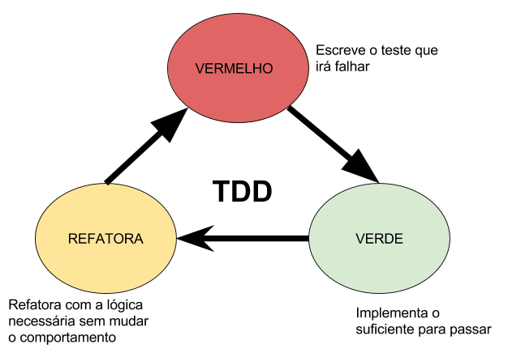

## Desenvolvimento guiado por testes

O TDD, conforme vimos anteriormente, é um processo de desenvolvimento de software que visa o feedback rápido e a garantia do funcionamento da aplicação de acordo com o que foi definido.

Relembrando o processo, podemos pensar que ele funciona como pequenos ciclos onde:

* 1 - Partimos da escrita de testes a partir dos requisitos;
* 2 - Em seguida, implementamos a funcionalidade;
* 3 - E, por último, fazemos os ajustes necessários para que testes e implementação estejam alinhados.

Concluindo o ciclo, iniciamos um novo para uma nova funcionalidade.



_Ciclo do TDD_

## Tipos de Testes

Durante essa aula, focaremos nos dois tipos de testes mais comuns: testes unitários/de unidade e testes de integração.

## Testes Unitários (Unit Tests)

Conforme definido por Martin Fowler , importante nome na arquitetura de software, testes unitários são de baixo nível, com foco em pequenas partes do software e tendem a ser mais rapidamente executados quando comparados com outros testes, pois testam partes isoladas.

O conceito de unidade porém, pode variar de projeto, linguagem, time ou arquitetura. Linguagens orientadas a objetos tendem a ter classes como uma unidade, já linguagens procedurais ou funcionais consideram normalmente funções como sendo uma unidade.

Dessa forma, esse conceito é algo muito relativo e depende muito do contexto e do objetivo em questão. O que podemos ter nítido é que uma unidade é uma parte que pode ter seu comportamento isolado de suas dependências.

Lembrando da aula anterior sobre MSC e sobre o padrão em sí, podemos dizer que cada função da camada de Model , por exemplo, é uma unidade. Dessa forma, conseguimos isolar essa função e testar seu comportamento de maneira unitária.

## Requisitos

Para o exemplo dessa aula desenvolveremos uma API utilizando os padrões REST e MSC. Essa API deverá permitir a realização de inserção e consulta de filmes no banco de dados.

De maneira detalhada temos os seguintes requisitos:

* 1 - A API deverá permitir a inserção de filmes no banco de dados:
  * Ela deve receber e registrar as seguintes informações do filme: `Nome, Direção e Ano de lançamento`;
  * Ao realizar a inserção de um novo filme, o endpoint deverá responder com o respectivo `ID`;

* 2 - A API deverá permitir a consulta de todos os filmes:
  * A consulta deve retornar uma matriz com todos os detalhes dos filmes;

* 3 - A API deverá permitir a consulta de um filme específico através do seu ID:
  * A consulta deve retornar todos os dados cadastrados para aquele `ID`.

  Antes de começarmos, vamos estruturar uma API de exemplo utilizando o modelo MSC com boas práticas, nesse caso, dividindo as entidades por seus papéis técnicos ,

Antes de começarmos, vamos estruturar uma API de exemplo utilizando o modelo MSC com boas práticas, nesse caso, dividindo as entidades por seus papéis técnicos,

```

└── controllers
│   └── movieController.js
└── services
│   └── movieService.js
└── models
│   └── movieModel.js
└── tests
│   ├── controllers
│   │   └── movieController.test.js
│   ├── services
│   │   └── movieService.test.js
│   └── models
│       └── movieModel.test.js
└── index.js
```

Perceba que criamos um arquivo de teste para a entidade movie para cada camada do MSC. Dessa forma, conseguiremos testar unitariamente cada uma.

Na raiz do projeto vamos iniciar o npm:
```sh
 npm init -y
```

E então, instalar as dependências para nossa API. Iremos utilizar o express , body-parser e o mongodb:

```sh
 npm install express body-parser mongodb
```

Vamos instalar também as nossa dependências de desenvolvimento, por enquanto sabemos que iremos utilizar a stack de testes vista anteriormente com `mocha, chai e sinon`:
```sh
 npm install -D mocha chai sinon
```

Por último, vamos adicionar o script de teste no `package.json`.

Habitualmente, podemos executar todos os testes contidos numa pasta utilizando o comando `mocha <suaPastaDeTestes> --recursive`, assim como podemos também definir um padrão de arquivos de teste, como `mocha .<suaPastaDeTestes>/**/*.test.js`, que executará todos os arquivos com final `test.js` dentro da sua pasta de testes.

Para esse dia, vamos utilizar um pequeno artifício com o intúito de facilitar a execução de testes específicos. Nesse caso, utilizaremos o comando `mocha ./tests/**/*$NAME*.test.js`:

```json
...
  "scripts": {
    "test": "mocha ./tests/**/*$NAME*.test.js --exit"
  },
...
```
O `--exit` força o encerramento do processo do mocha ao final dos testes.

Dessa forma, podemos executar o comando `npm test` para validar todos os nossos testes, ou, utilizar uma variável de ambiente `NAME` para definir um arquivo específico: `NAME=nomeDoArquivo npm test`.

## Model e testes

Começaremos testando a camada de model, pensando de maneira sequencial, essa camada fica em uma das pontas da arquitetura e, por isso, iniciaremos por ela. Entretanto, é importante termos em mente que por se tratar de testes unitários, estaremos testando uma unidade específica do código isolado, sendo assim, poderíamos iniciar por qualquer parte.

Seguindo o TDD, o primeiro passo é escrevermos os casos de testes. Para isso, precisamos nos perguntar o que iremos testar, ou seja, qual a responsabilidade que queremos garantir que está sendo realizada.

**Relembrando o papel do model, ele é responsável pela estrutura dos dados e seu armazenamento, por exemplo, responsável pela comunicação com o banco de dados e pelo mapeamento das entidades.**

Sendo assim, iremos testar se essa comunicação com o BD e suas operações de escrita e leitura estão sendo realizadas da maneira correta.

## Requisitos em testes (Model)

Vamos relembrar nosso primeiro requisito:

* 1 - A API deverá permitir a inserção de filmes no banco de dados:
  * Ela deve receber e registrar as seguintes informações do filme: `Nome, Direção e Ano de lançamento`;
  * Ao realizar a inserção de um novo filme, o endpoint deverá responder com o respectivo `ID`;

Relembrando o papel do Model com as seguintes asserções/ afirmações:

* 1 - Insere um novo filme no DB:
  * quando é inserido com sucesso
    * retorna um array
    * o array está vazio
  * quando existir filmes criados
    * retorna um array
    * o array não está vazio
    * o array possui itens do tipo objeto
    * tais itens possuem as propriedades: "id", "title", "releaseYear" e "directedBy"

Agora vamos reescrever essas mesmas asserções na estrutura de testes:

_tests/models/movieModel.test.js_

```js
const { expect } = require('chai');

/*
  Como ainda não temos a implementação, vamos fixar
  um objeto simulando os métodos que iremos desenvolver,
  porém, eles não terão nenhum comportamento
*/
const MoviesModel = {
  create: () => {}
};

describe('Insere um novo filme no BD', () => {
  const payloadMovie = {
    title: 'Example Movie',
    directedBy: 'Jane Dow',
    releaseYear: 1999,
  }

  describe('quando é inserido com sucesso', async () => {

    it('retorna um objeto', async () => {
      const response = await MoviesModel.create(payloadMovie);

      expect(response).to.be.a('object')
    });

    it('tal objeto possui o "id" do novo filme inserido', async () => {
      const response = await MoviesModel.create(payloadMovie);

      expect(response).to.have.a.property('id')
    });

  });
});
```

Agora, como só temos esse teste a princípio, vamos executa-lo com `npm test` ou, específicamente, com `NAME=movieModel npm test`, e a saída no terminal será semelhante a essa:

### Implementação

O segundo passo é de fato implementarmos nossa camada de model de acordo com os testes escritos.

Vamos começar criando o arquivo de conexão com o banco de dados, utilizaremos o MongoDB:

_models/connection.js_

```js
const { MongoClient } = require('mongodb');

const MONGO_DB_URL = 'mongodb://127.0.0.1:27017';

let schema = null;

async function connection() {
  if (schema) return Promise.resolve(schema);
  return MongoClient
    .connect(MONGO_DB_URL, {
      useNewUrlParser: true,
      useUnifiedTopology: true,
    })
    .then((conn) => conn.db('model_example'))
    .then((dbSchema) => {
      schema = dbSchema;
      return schema;
    })
    .catch((err) => {
      console.error(err);
    });
}

module.exports = connection;
```

E então, iniciaremos nosso model de movies importando tal conexão e então criando o método para criação de filmes:


_models/movieModel.js_
```js
const connection = require('./connection');

const create = async ({ title, directedBy, releaseYear }) => {
  const moviesCollection = await connection()
    .then((db) => db.collection('movies'));

  const { insertedId: id } = await moviesCollection
    .insertOne({ title, directedBy, releaseYear });

  return {
    id,
  };
};

module.exports = {
  create,
};
```

### Refactor e Test Doubles

Agora vamos para o último passo do TDD, revisitaremos os testes escritos para realizar os ajustes necessários de acordo com a nossa implementação!

Vamos começar editando nosso teste para utilizar nossa implementação:

_tests/models/movieModel.test.js_
```js
// const { expect } = require('chai');

const MoviesModel = require('../../models/movieModel');

// describe('Insere um novo filme no BD', () => {
//   const payloadMovie = {
//   title: 'Example Movie',
//   directedBy: 'Jane Dow',
//   releaseYear: 1999,
// };

//   describe('quando é inserido com sucesso', async () => {

//     it('retorna um objeto', async () => {
//       const response = await MoviesModel.create(payloadMovie);

//       expect(response).to.be.a('object');
//       });

//       it('tal objeto possui o "id" do novo filme inserido', async () => {
//       const response = await MoviesModel.create(payloadMovie);

//       expect(response).to.have.a.property('id');
//     });

//   });
// });
```

Perceba que o nosso teste ainda não está funcionando. Isso aconteceu porque no caso onde o print foi tirado, não havia um serviço do Mongo rodando na máquina e a implementação não conseguiu se conectar causando o erro. Caso você tenha iniciado o MongoDB em sua máquina, o teste deverá passar com sucesso, porém, não é o objetivo agora.

Vimos anteriormente que para criarmos testes precisamos isolar o SUT (System Under Test), ou seja, garantirmos que estamos testando somente um trecho de código que tem uma função específica sem adicionarmos comportamentos ou variáveis externas a esse contexto.

Você já deve estar imaginando o que será necessário fazer para conseguirmos testar essa camada. Se você pensou em fazer stub para os drivers dos bancos que estamos utilizando, acertou!

Vamos ver um exemplo de como podemos utilizar o já conhecido sinon nessa tarefa.

Para isso, ao invés de subirmos um BD (Mongo), iremos fazer um stub da conexão, fazendo-a retornar um mock da conexão, ou seja, ela irá retornar um objeto com as mesmas características da conexão real, porém, serão funções falsas criadas por nós:

_tests/models/movieModel.test.js_
```js
const sinon = require('sinon');
// const { expect } = require('chai');
const { MongoClient } = require('mongodb');

// const MoviesModel = require('../../models/movieModel');

// describe('Insere um novo filme no BD', () => {
//   const payloadMovie = {
//      title: 'Example Movie',
//      directedBy: 'Jane Dow',
//      releaseYear: 1999,
//   };

      before(() => {
        const ID_EXAMPLE = '604cb554311d68f491ba5781';
        const connectionMock = {
          db: async () => ({
            collection: async () => ({
              insertOne: async () => ({
                insertedId: ID_EXAMPLE,
              })
            })
          })
        };

        sinon.stub(MongoClient, 'connect').resolves(connectionMock);
      });

      // Restauraremos a função `connect` original após os testes.
      after(() => {
        MongoClient.connect.restore();
      });

//    describe('quando é inserido com sucesso', async () => {

//      it('retorna um objeto', async () => {
//        const response = await MoviesModel.create(payloadMovie);

//        expect(response).to.be.a('object');
//      });

//      it('tal objeto possui o "id" do novo filme inserido', async () => {
//        const response = await MoviesModel.create(payloadMovie);

//        expect(response).to.have.a.property('id');
//      });

//    });

// });
```

### BD em memória

Perceba o quão trabalhoso foi criar nosso stub, precisamos conhecer exatamente a nossa implementação para saber qual método do driver estamos utilizando e qual deveriam ser suas respostas.

Além disso, a resposta de alguns métodos que utilizamos possuem um tipo próprio com suas especificações, por exemplo, ao executar um find no mongo, nos é retornado um cursor . Esse cursor possui métodos próprios como sort , limit e toArray . E, se utilizarmos eles em nossa implementação, teremos que nos preocupar em retornar um objeto com esses mesmos métodos em nossos stubs para que nosso teste funcione.

Para nos ajudar com essa tarefa existe uma outra estratégia que é bastante difundida em diversas linguagens para isolar o IO de banco de dados: utilizar um banco de dados em memória.

A ideia é subirmos uma versão especial do BD que queremos em memória, dessa forma, ele não persistira nenhuma informação em disco (sem realizar IO) e ao final de cada teste podemos limpá-lo. Como essa versão do banco está em memória, ao finalizar os testes, as informações também serão apagadas.

Existem diversas ferramentas que criam esse tipo de objeto para nós, dessa forma, teremos um objeto que se comporta exatamente como o nosso banco de dados real, porém, sem realizar nenhuma operação de IO e após os testes todos os cenários serão limpos.

Para colocar em prática esse conceito começaremos utilizando uma versão em memória do mongodb , para isso, utilizaremos o pacote para NodeJS [mongodb-memory-server](https://github.com/nodkz/mongodb-memory-server).

Para instalá-lo é simples, basta utilizarmos o gerenciador de pacotes da nossa preferência, como o npm:

```sh
npm install -D mongodb-memory-server
```
Como só utilizaremos esse pacote em tempo de desenvolvimento para os testes, é importante adicionarmos a flag `-D` ou `--save-dev`.

Iremos então iniciar um server do banco em memória e fazer um stub da conexão conectando nesse server:

_tests/models/movieModel.test.js_
```js
// const sinon = require('sinon');
// const { expect } = require('chai');
// const { MongoClient } = require('mongodb');
const { MongoMemoryServer } = require('mongodb-memory-server');

// const MoviesModel = require('../../models/movieModel');

// describe('Insere um novo filme no BD', () => {
//   const payloadMovie = {
//     title: 'Example Movie',
//     directedBy: 'Jane Dow',
//     releaseYear: 1999,
//   };

    before(async () => {

      const DBServer = new MongoMemoryServer();
      const URLMock = await DBServer.getUri();

      const connectionMock = await MongoClient
        .connect(URLMock, {
          useNewUrlParser: true,
          useUnifiedTopology: true
        });

      sinon.stub(MongoClient, 'connect').resolves(connectionMock);

    });

//   after(() => {
//     MongoClient.connect.restore();
//   });

//   describe('quando é inserido com sucesso', async () => {

//     it('retorna um objeto', async () => {
//       const response = await MoviesModel.create(payloadMovie);

//       expect(response).to.be.a('object');
//     });

//     it('tal objeto possui o "id" do novo filme inserido', async () => {
//       const response = await MoviesModel.create(payloadMovie);

//       expect(response).to.have.a.property('id');
//     });

//   });

// });
```

### Service e testes

Seguindo nossa sequência iremos testar a camada de services.

**Relembrando o papel dessa camada, podemos definí-la como responsável pela lógica de negócio, sendo acessada pelo controller e acessando o model , ou seja, ficando situada entre as duas camadas.**

Relembrando nossos requisitos vamos identificar quais comportamentos precisaremos garantir:

* 1 - A API deverá permitir a inserção de filmes no banco de dados:
  * Ela deve receber e registrar as seguintes informações do filme: `Nome, Direção e Ano de lançamento`;
  * Ao realizar a inserção de um novo filme, o endpoint deverá responder com o respectivo `ID`;

  Com base no requisito podemos descrever um Service com as seguintes asserções/regras:

_tests/services/movieService.test.js_
```js
const { expect } = require('chai');

const MoviesService = {
  create: () => {},
};

/*
  Precisamos validar se estamos recebendo todos os campos
  necessários para a operação. Como trata-se de uma regra
  de negócio, validaremos na camada de serviços.
*/
describe('Insere um novo filme no BD', () => {
  describe('quando o payload informado não é válido', async () => {
    const payloadMovie = {};

    it('retorna um boolean', async () => {
      const response = await MoviesService.create(payloadMovie);

      expect(response).to.be.a('boolean');
    });

    it('o boolean contém "false"', async () => {
      const response = await MoviesService.create(payloadMovie);

      expect(response).to.be.equal(false);
    });

  });

  describe('quando é inserido com sucesso', async () => {
    const payloadMovie = {
      title: 'Example Movie',
      directedBy: 'Jane Dow',
      releaseYear: 1999,
    };

    it('retorna um objeto', async () => {
      const response = await MoviesService.create(payloadMovie);

      expect(response).to.be.a('object');
    });

    it('tal objeto possui o "id" do novo filme inserido', async () => {
      const response = await MoviesService.create(payloadMovie);

      expect(response).to.have.a.property('id');
    });

  });
});
```


Agora vamos implementar a camada conforme os requisitos:

_services/movieService.js_
```js
const MoviesModel = require('../models/movieModel');

const isValid = (title, directedBy, releaseYear) => {
  if (!title || typeof title !== 'string') return false;
  if (!releaseYear || typeof releaseYear !== 'number') return false;
  if (!directedBy || typeof directedBy !== 'string') return false;

  return true;
};

const create = async ({ title, directedBy, releaseYear }) => {
  const isMovieValid = isValid(title, directedBy, releaseYear);

  if (!isMovieValid) return false;

  const { id } = await MoviesModel
    .create({ title, directedBy, releaseYear });

  return {
    id,
  };
};

module.exports = {
  create,
};
```

Vamos então adaptar nosso teste para chamar nossa implementação:

_tests/services/movieService.test.js_
```js
// const { expect } = require('chai');

const MoviesService = require('../../services/movieService');

// describe('Insere um novo filme no BD', () => {
//   describe('quando o payload informado não é válido', async () => {
//     const payloadMovie = {};

//     it('retorna um boolean', async () => {
//       const response = await MoviesService.create(payloadMovie);

//       expect(response).to.be.a('boolean');
//     });

//     it('o boolean contém "false"', async () => {
//       const response = await MoviesService.create(payloadMovie);

//       expect(response).to.be.equal(false);
//     });

//   });

//   describe('quando é inserido com sucesso', async () => {
//     const payloadMovie = {
//       title: 'Example Movie',
//       directedBy: 'Jane Dow',
//       releaseYear: 1999,
//     };

//     it('retorna um objeto', async () => {
//       const response = await MoviesService.create(payloadMovie);

//       expect(response).to.be.a('object');
//     });

//     it('tal objeto possui o "id" do novo filme inserido', async () => {
//       const response = await MoviesService.create(payloadMovie);

//       expect(response).to.have.a.property('id');
//     });

//   });
// });
```
Perceba que o primeiro teste rodou com sucesso, a validação é realizada totalmente na camada de service. Porém, o segundo teste, como depende da camada de Model para funcionar, conforme esperado, o teste não concluiu com sucesso.

Vamos então isolar nosso service, removendo a dependência dele do Model. Para isso, podemos fazer um stub :

_tests/services/movieService.test.js_
```js
const sinon = require('sinon');
// const { expect } = require('chai');

const MoviesModel = require('../../models/movieModel');
// const MoviesService = require('../../services/movieService');

// describe('Insere um novo filme no BD', () => {
//   describe('quando o payload informado não é válido', async () => {
//     const payloadMovie = {};

//     it('retorna um boolean', async () => {
//       const response = await MoviesService.create(payloadMovie);

//       expect(response).to.be.a('boolean');
//     });

//     it('o boolean contém "false"', async () => {
//       const response = await MoviesService.create(payloadMovie);

//       expect(response).to.be.equal(false);
//     });

//   });

//   describe('quando é inserido com sucesso', async () => {
//     const payloadMovie = {
//       title: 'Example Movie',
//       directedBy: 'Jane Dow',
//       releaseYear: 1999,
//     };

    before(() => {
      const ID_EXAMPLE = '604cb554311d68f491ba5781';

      sinon.stub(MoviesModel, 'create')
        .resolves({ id: ID_EXAMPLE });
    });

    // Restauraremos a função `create` original após os testes.
    after(() => {
      MoviesModel.create.restore();
    });

//     it('retorna um objeto', async () => {
//       const response = await MoviesService.create(payloadMovie);

//       expect(response).to.be.a('object');
//     });

//     it('tal objeto possui o "id" do novo filme inserido', async () => {
//       const response = await MoviesService.create(payloadMovie);

//       expect(response).to.have.a.property('id');
//     });

//   });
// });
```

### Controllers e testes

E por último vamos escrever testes e implementar a camada de Controller.

**Essa camada recebe as requisições dos clientes, preparando o input e o output da pessoa usuária de acordo com sua comunicação com a camada de Service.**

Dessa forma, nos testes devemos contemplar qual a resposta para o cliente apropriado em cada cenário, qual o `status` e o `body` em cada resposta:

Ao chamar o método `create` do controller `movieController` esperamos:

* 1 - Quando o payload informado não é válido:
  * Retornar o código de status 400 - Bad Request;
  * Retornar a mensagem Dados inválidos.

* 2 - Quando o payload informado é válido:
  * Retornar o código de status 201 - Created;
  * Retornar a mensagem Filme criado com sucesso!


Percebam que os testes do controller tem uma particularidade em sua implementação. Isso acontece porque diferente das outras camadas, o controller não possui funções simples que retornam um resultado qualquer, mas sim middlewares que funcionam a partir dos objetos req, res, next e error.

Dessa forma, para conseguirmos testar, precisaremos passar um input a partir do req e validar o output a partir do res, validando se os devidos métodos foram chamados e com os parâmetros esperados.

Para nos ajudar com essa tarefa iremos utilizar recursos do sinon, observe como ira ficar no teste do movieController.

_tests/controllers/movieController.test.js_
```js
const sinon = require('sinon');
const { expect } = require('chai');

const MoviesController = {
  create: () => {}
};

describe('Ao chamar o controller de create', () => {
  describe('quando o payload informado não é válido', async () => {
    const response = {};
    const request = {};

    before(() => {
      request.body = {};

      response.status = sinon.stub()
        .returns(response);
      response.send = sinon.stub()
        .returns();
    })

    it('é chamado o status com o código 400', async () => {
      await MoviesController.create(request, response);

      expect(response.status.calledWith(400)).to.be.equal(true);
    });

    it('é chamado o send com a mensagem "Dados inválidos"', async () => {
      await MoviesController.create(request, response);

      expect(response.send.calledWith('Dados inválidos')).to.be.equal(true);
    });

  });

  describe('quando é inserido com sucesso', async () => {
    const response = {};
    const request = {};

    before(() => {
      request.body = {
        title: 'Example Movie',
        directedBy: 'Jane Dow',
        releaseYear: 1999,
      };

      response.status = sinon.stub()
        .returns(response);
      response.send = sinon.stub()
        .returns();
    })

    it('é chamado o status com o código 201', async () => {
      await MoviesController.create(request, response);

      expect(response.status.calledWith(201)).to.be.equal(true);
    });

    it('é chamado o send com a mensagem "Filme criado com sucesso!"', async () => {
      await MoviesController.create(request, response);

      expect(response.send.calledWith('Filme criado com sucesso!')).to.be.equal(true);
    });

  });
});
```
Criamos stubs específicos para simular funções de resposta ( response ), dessa forma conseguimos utilizar o método calledWith fornecido pelo Sinon para testarmos se a função foi chamada com os parâmetros esperados.

Por exemplo, no trecho de código abaixo, validamos se o método `res.status` (ou `response.status` ) foi chamado passando o `status code 400`. Lembre-se que é dessa forma que nossa API responde à requisição da pessoa usuária, utilizando API's REST com frameworks de middleware, como o express.

```js
expect(response.status.calledWith(400)).to.be.equal(true);
```

Ao rodar os testes com NAME=movieController npm test , eles deverão quebrar. Por tanto, vamos à implementação da nossa camada. Podemos fazê-la da seguinte maneira:

_controllers/movieController.js_
```js
const MoviesService = require('../services/movieService');

const create = async (req, res) => {
  const { title, directedBy, releaseYear } = req.body;

  const movie = await MoviesService
  .create({ title, directedBy, releaseYear });

  if (!movie) {
    return res
      .status(400)
      .send('Dados inválidos');
  }

  /*
    Perceba que `middlewares`, ao invés de executar um `return` padrão,
    como outras funções, vão, na maior parte das vezes, devolver as
    funções passadas por parâmetro, através dos objetos `req, res, next`.

    No nosso caso, estamos utilizando os métodos `status()` e `send()`,
    de `res` (response) para escrever/devolver um valor para a
    requisição daquele `end-point`.
  */
  res
    .status(201)
    .send('Filme criado com sucesso!');
};

module.exports = {
  create,
};
```
Feito isso, vamos para o passo de refatoração ( refactor ), ajustando os testes para receberem nossa implementação e também isolar nosso controller das demais camadas:

_tests/controllers/movieController.test.js_
```js
// const sinon = require('sinon');
// const { expect } = require('chai');

const MoviesService = require('../../services/movieService');
const MoviesController = require('../../controllers/movieController');

// describe('Ao chamar o controller de create', () => {
//   describe('quando o payload informado não é válido', async () => {
//     const response = {};
//     const request = {};

//     before(() => {
//       request.body = {};

//       response.status = sinon.stub()
//         .returns(response);
//       response.send = sinon.stub()
//         .returns();

      /*
        Perceba que nosso stub também simula os comportamentos do `service`,
        dessa forma, conseguimos testar o comportamento do controller de
        maneira isolada.

        Aqui, todos os testes que requisitarem o serviço, devem receber
        retorno `false`.
      */
      sinon.stub(MoviesService, 'create')
        .resolves(false);
//     });

    // Restauraremos a função `create` original após os testes.
    after(() => {
      MoviesService.create.restore();
    });

//     it('é chamado o status com o código 400', async () => {
//       await MoviesController.create(request, response);

//       expect(response.status.calledWith(400)).to.be.equal(true);
//     });

//     it('é chamado o send com a mensagem "Dados inválidos"', async () => {
//       await MoviesController.create(request, response);

//       expect(response.send.calledWith('Dados inválidos')).to.be.equal(true);
//     });

//   });

//   describe('quando é inserido com sucesso', async () => {
//     const response = {};
//     const request = {};

//     before(() => {
//       request.body = {
//         title: 'Example Movie',
//         directedBy: 'Jane Dow',
//         releaseYear: 1999,
//       };

//       response.status = sinon.stub()
//         .returns(response);
//       response.send = sinon.stub()
//         .returns();

      /*
        Aqui, todos os testes que requisitarem o serviço, devem receber
        retorno `true`.
      */
      sinon.stub(MoviesService, 'create')
        .resolves(true);
//     })

    // Restauraremos a função `create` original após os testes.
    after(() => {
      MoviesService.create.restore();
    });

//     it('é chamado o status com o código 201', async () => {
//       await MoviesController.create(request, response);

//       expect(response.status.calledWith(201)).to.be.equal(true);
//     });

//     it('é chamado o send com a mensagem "Filme criado com sucesso!"', async () => {
//       await MoviesController.create(request, response);

//       expect(response.send.calledWith('Filme criado com sucesso!')).to.be.equal(true);
//     });

//   });
// });
```
### Rodando nosso código!

Agora que temos todas as camadas devidamente testadas, sabemos que todos os comportamentos estão sendo cobertos pela camada responsável.

Para finalizarmos, basta criarmos nosso arquivo index.js com a implementação dos nossos endpoints REST, utilizando express e chamando nosso controller.

_index.js_
```js
const express = require('express');
const bodyParser = require('body-parser');

const MovieController = require('./controllers/movieController');

const app = express();

app.use(bodyParser.json());

app.post('/movies', MovieController.create);

const PORT = process.env.PORT || 3000;

app.listen(PORT, () => {
  console.log(`Ouvindo a porta ${PORT}`);
});
```
Só precisamos garantir agora que temos um serviço do MongoDB acessível, conforme configuramos na camada de model ( models/connection.js ) e nossa aplicação está pronta para rodar!