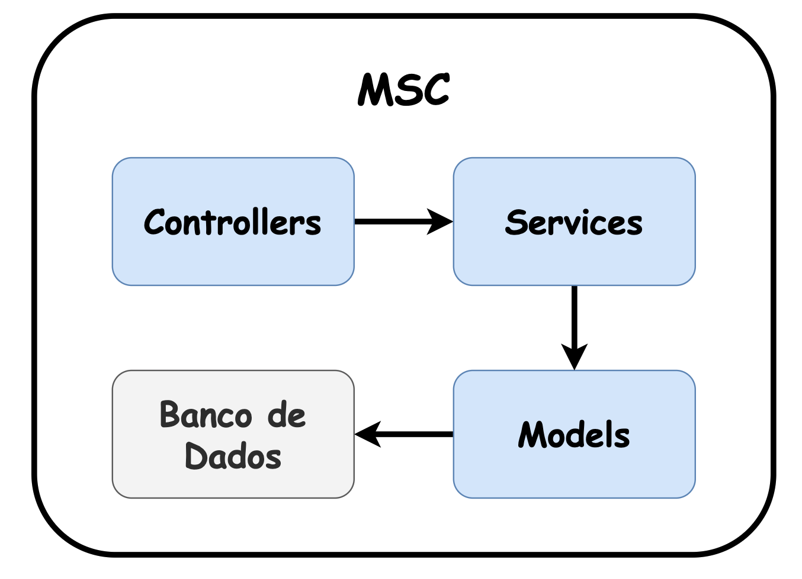
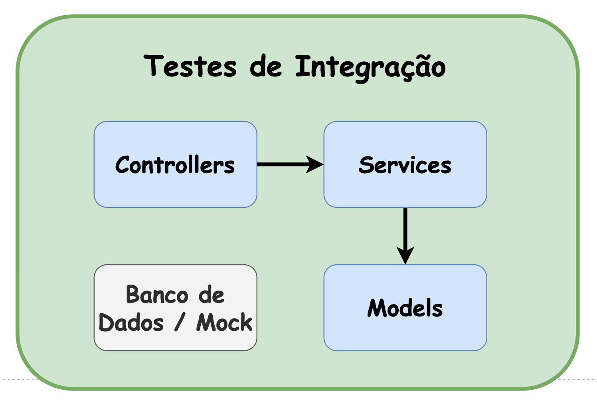
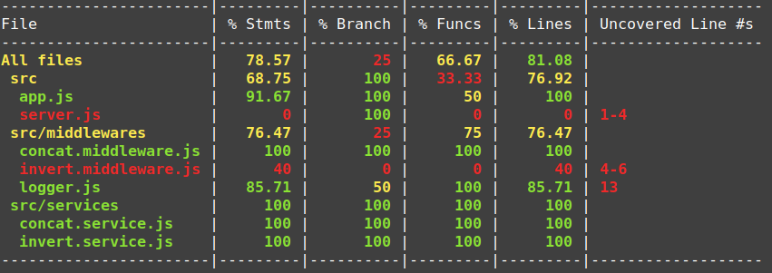
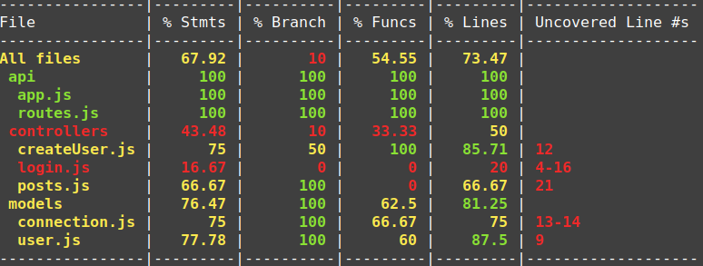

# Testes de Integração (Integration Tests)

Aprendemos anteriormente sobre testes unitários e como podemos testar cada unidade do nosso código de maneira individual. Por exemplo, ao utilizarmos o padrão MSC podemos definir cada camada como sendo uma unidade:



_Arquitetura MSC_

Dessa forma, podemos testar cada camada, ou seja, cada unidade de maneira separada, isolando uma parte da outra e escrevendo testes individuais para cada uma:


_Testes Unitários_

Os testes de integração, ou integration tests , servem para verificar se a comunicação entre os componentes de um sistema estão ocorrendo conforme o esperado.

Diferente dos testes unitários, onde isolamos cada unidade como fizemos com cada camada do MSC, nos testes de integração o comportamento deverá ser testado com a integração entre todas as unidades.

Ambos os tipos de testes são importantes, porém, cada um tem um objetivo diferente.

Da mesma forma como definir uma unidade é subjetivo, não existe um nível de granularidade específico de integração para ser testada, sendo possível adaptar esse conceito de acordo com os objetivos desejados.

Nossa integração partirá do recebimento do objeto da requisição ( request ), seguindo com o controlador ( controller ), o serviço ( service ) e terminando no modelo ( model ). Iremos apenas isolar a comunicação do model com o Banco de dados para evitarmos operações de IO. Podemos representar isso da seguinte maneira:



_Testes de Integração_

# Contratos

Agora que já sabemos o nível de integração que iremos testar, ou seja, quais partes serão cobertas pelos nossos testes, precisamos saber **o que exatamente queremos testar e de qual forma**.

Sempre quando consumimos ou fornecemos um serviço, como por exemplo uma API REST, precisamos ter os comportamentos pré definidos. Esses comportamentos são definidos de acordo com as regras de entrada e saída de dados da API.

Por exemplo, ao chamar um endpoint `GET /users/:userId` passamos um ID de usuário e esperamos receber os dados referentes aquele usuário com um código `http 200 - OK`. Caso o usuário não seja encontrado, esperamos receber um status `http 404 - Not Found`, por exemplo.

Perceba que temos diversos padrões definidos e comportamentos esperados. Dessa forma, podemos testar exatamente se esses comportamentos estão sendo cumpridos por nossas API's, retornando uma resposta compatível com o cenário.

Em testes, esse conceito é chamado de contratos . Por exemplo, ao se alugar um imóvel, é necessário assinar um contrato onde está definido tudo aquilo que foi combinado entre as partes. Nos testes de contratos de API, a ideia é bem semelhante, o contrato define aquilo que foi previamente acordado, ou seja, como a API deverá se comportar em um determinado cenário.

Para ficar ainda mais nítido, vamos utilizar novamente o endpoint `GET /users/:userId`. Podemos dizer que o contrato dele é, quando a pessoa usuária existe, retornar a seguinte resposta:

* Código `HTTP: 200 - OK`;
* Body:

```json
{
    "id": "123",
    "name": "jane",
    "fullName": "Jane Doe",
    "email": "janedoe@trybemail.com"
}
```

Esse conceito trabalha muito bem junto com os testes de integração, pois podemos testar se cada contrato está sendo cumprido após o processamento de todas as camadas.

# Escrevendo testes

### Baixando o repositório base
[Repositório](https://github.com/tryber/nodejs-jwt-base-project/tree/block-28-3)

### Preparando o ambiente

Antes de mais nada, devemos fazer a instalação dos pacotes que já conhecemos anteriormente, para utilizaremos em ambiente de desenvolvimento, nos testes:

```sh
npm i -D mocha chai sinon
```

Aqui, também é necessário a inicialização de um script de testes no `package.json`:
```json
...
"scripts": {
    ...
    "test": "mocha ./tests/**/*$NAME*.test.js --exit",
},
...
```

### Escrevendo um teste base

Agora vamos iniciar escrevendo testes para a rota de criação de usuários.

Conforme definido, ao criar um usuário com sucesso o endpoint deverá responder:

* com o status `http 201 - OK`;
* com um objeto JSON, contendo a propriedade message com o valor `"Novo usuário criado com sucesso"`.

Essa definição é o contrato da nossa API. Podemos transformá-lo em teste convertendo-o para asserções/afirmações, igual já fizemos anteriormente com o `mocha` e o `chai`:

_tests/createUsers.test.js_
```js
const chai = require('chai');

const { expect } = chai;

describe('POST /api/users', () => {
    describe('quando é criado com sucesso', () => {
        let response = {};

        it('retorna o código de status 201', () => {
            expect(response).to.have.status(201);
        });

        it('retorna um objeto', () => {
            expect(response.body).to.be.a('object');
        });

        it('o objeto possui a propriedade "message"', () => {
            expect(response.body).to.have.property('message');
        });

        it('a propriedade "message" possui o texto "Novo usuário criado com sucesso"',
            () => {
                expect(response.body.message)
                    .to.be.equal('Novo usuário criado com sucesso');
            });
    });
});
```
Agora que temos nosso contrato expresso em código precisamos validar se nossa aplicação está obedecendo aquilo que está definido nele.

### Testando nossa API

Iremos testar toda nossa API de maneira integrada, ou seja, queremos testar que dado um valor de entrada, o mesmo será processado pelas diversas partes da API, então, nos dar um retorno conforme estabelecido pelo nosso "contrato". Diferente de como fizemos antes testando cada unidade da API com os testes unitários por camada.

Para nos ajudar com esse desafio, utilizaremos o [plugin Chai HTTP](https://www.chaijs.com/plugins/chai-http/) com esse plugin poderemos simular uma request a nossa API.

Primeiro precisamos instalar esse novo pacote, para isso, execute:
```sh
npm install -D chai-http
```

E então no nosso teste iremos adicionar o seguinte trecho, adicionando o plugin a instância do chai:
```js
// const chai = require('chai');
const chaiHttp = require('chai-http');

chai.use(chaiHttp);

// const { expect } = chai

// ...
```

Adicionado o plugin ao chai, poderemos consumir nosso server em express através dele, sem que haja a necessidade de subirmos a api manualmente. Para isso basta importarmos nossa api e então passamos ela como parâmetro ao método request do chai.

Nesse caso, uma boa prática para a arquitetura da API, é fazer a separação do conjunto da definição das rotas e regras de middlewares (Em um arquivo app.js , por exemplo. Que vai ser consumido pelo chaiHttp ) , do servidor propriamente dito, que consome essas regras (Esse continuaria em server.js , para utilizarmos em contextos de não-teste):

```js
// ./src/api/app.js
const express = require('express');
const bodyParser = require('body-parser');
const routes = require('./routes');

const app = express();

app.use(bodyParser.urlencoded({ extended: false }));
app.use(bodyParser.json());

const apiRoutes = express.Router();
apiRoutes.get('/api/posts', routes.getPosts);
apiRoutes.post('/api/users', routes.createUsers);
apiRoutes.post('/api/login', routes.login);

app.use(apiRoutes);

/*
    Detalhe para a exportação do `app`, já que
    precisaremos dele nos testes com `chaiHttp`
*/
module.exports = app;
```

```js
// ./src/api/server.js
const port = process.env.PORT || 8080;
const app = require('./app');

app.listen(port);
console.log('conectado na porta ' + port);
```

Após essa separação, voltando em `createUsers.test.js`, podemos testar nossos end-points utilizando a referência deles contida em `./src/api/app.js`:

```js
// const chai = require('chai');
// const chaiHttp = require('chai-http');

const server = require('../src/api/app');

// chai.use(chaiHttp);

// const { expect } = chai;

// describe('POST /api/users', () => {
//     describe('quando é criado com sucesso', () => {
//        let response;

        before(async () => {
            response = await chai.request(server);
        });

        /*
            Veremos adiante o exemplo completo 😉
        */
//    });
//});
```
Após chamarmos o método request passando o nosso server, podemos chamar diretamente nossos end-points, simulando chamadas HTTP.

Vejamos alguns exemplos disso:
```js
/*
    Podemos chamar um `GET` que deve consumir nossa api,
    sem que pra isso precisemos subir ela manualmente
*/
const response = await chai.request(server)
  .get('/exemplo');

/*
    Da mesma forma, podemos chamar um `POST` passando um
    `body` e/ou um `header`, por exemplo:
*/
const response = await chai.request(server)
  .get('/favorite-foods')
  .set('X-API-Key', 'foobar')
  .send({
      name: 'jane',
      favoriteFood: 'pizza'
  });
```

Dessa forma, o plugin nos ajudará a consumir nossa API em nossos testes de maneira muito simples, veja como ficará nosso teste após o refactor completo:
```js
const chai = require('chai');
const chaiHttp = require('chai-http');

const server = require('../src/api/app');

chai.use(chaiHttp);

const { expect } = chai;

describe('POST /api/users', () => {
    describe('quando é criado com sucesso', () => {
        let response;

        before(async () => {
            response = await chai.request(server)
                .post('/api/users')
                .send({
                    username: 'jane',
                    password: 'senha123'
                });
        });

        it('retorna o código de status 201', () => {
            /*
                Perceba que aqui temos uma asserção
                específica para o status da `response` 😬
            */
            expect(response).to.have.status(201);
        });

        it('retorna um objeto', () => {
            expect(response.body).to.be.a('object');
        });

        it('o objeto possui a propriedade "message"', () => {
            expect(response.body).to.have.property('message');
        });

        it('a propriedade "message" possui o texto "Novo usuário criado com sucesso"',
            () => {
                expect(response.body.message)
                    .to.be.equal('Novo usuário criado com sucesso');
            }
        );
    });
});
```
Antes de executarmos nossos testes, precisamos fazer mais um ajuste. Apesar de estarmos fazendo testes de integração, lembre-se que só queremos testar até nosso model , sem deixar que nossa aplicação de fato vá até o banco de dados, isolando o IO.

Para isso, utilizaremos novamente a estratégia de utilizar uma instância do nosso banco de dados em memória.

Nosso teste ficará assim:
```js
// const chai = require('chai');
const sinon = require('sinon');
// const chaiHttp = require('chai-http');

// const server = require('../src/api/app');

const { MongoClient } = require('mongodb');
const { MongoMemoryServer } = require('mongodb-memory-server');

// chai.use(chaiHttp);

// const { expect } = chai;

// describe('POST /api/users', () => {
//    describe('quando é criado com sucesso', () => {
//        let response;
        const DBServer = new MongoMemoryServer();

//        before(async () => {
            const URLMock = await DBServer.getUri();
            const connectionMock = await MongoClient.connect(URLMock,
                { useNewUrlParser: true, useUnifiedTopology: true }
            );

            sinon.stub(MongoClient, 'connect')
                .resolves(connectionMock);

//            response = await chai.request(server)
//                .post('/api/users')
//                .send({
//                    username: 'jane',
//                    password: 'senha123'
//                });
//        });

        after(async () => {
            MongoClient.connect.restore();
            await DBServer.stop();
        });

//        it('retorna o código de status 201', () => {
//            expect(response).to.have.status(201);
//        });

//        it('retorna um objeto', () => {
//            expect(response.body).to.be.a('object');
//        });

//        it('o objeto possui a propriedade "message"', () => {
//            expect(response.body).to.have.property('message');
//        });

//        it('a propriedade "message" possui o texto "Novo usuário criado com sucesso"',
//              () => {
//                  expect(response.body.message)
//                      .to.be.equal('Novo usuário criado com sucesso');
//              }
//        );
//    });
//});
```
E então podemos rodar nossos testes e, se nossa API estiver respeitando o contrato definido, teremos sucesso:

# Pensando testes para outros contextos
Como e qual teste preciso fazer? Pode não parecer em um primeiro momento, mas como dito anteriormente, a testagem de sistemas complexos fica muito mais simples se pensarmos nos contratos que as situações exigem.

Uma outra forma de medir o nível entre escopo e interação na idealização de um teste, é buscar uma especificidade para que possamos transforma-lo em requisito. Nesse sentido, considere a seguinte pergunta:

**Se precisasse fazer o teste manualmente, qual seria o meu processo/ "teste de mesa"?**

Antes de continuar , experimente fazer esse exercício individualmente, pensando o uso do JWT em uma API, em um contrato onde caso se tenha um login válido, deva ser possível trazer dados de posts (com status 200 - OK ).

Dependendo da resposta, podemos identificar os tipos de teste que precisaremos fazer:

```
## Exemplo de resposta nesse cenário

Utilizaria o `postman`, onde:
   - Faria um login válido na rota `POST /api/login` pra conseguir um `token`;
   - Aguardaria um status `200 - OK`, acompanhado de um JSON com o `token`;
   - Testaria a rota `GET /api/posts`, passando esse `token` no `header`:
     `authorization`;
   - Aguardaria um status `200 - OK`, acompanhado de um JSON com os `posts`.
```

Agora vamos identificar aqui aquilo que poderia ser um teste unitário e aquilo que caracteriza um teste de integração:

```
## Analisando linha a linha
 Utilizaria o `postman`, onde:
<!--
    Aqui já notamos que o teste requer uma estrutura que depende de um servidor
    rodando. Esse teste, por tanto, leva em consideração a `integração` de outros
    elementos, como a definição de um server, rotas e `controllers`;
-->
 Faria um login válido na rota `POST /api/login`* pra conseguir um `token`**
<!--
    [*] Se estivéssemos testando isoladamente um `model` que, ao receber os
    parâmetros de email e password, pode se comportar de uma forma ou outra,
    esse poderia ser um `teste unitário`;

    [**] Se estivéssemos testando isoladamente o `service` que gera nosso
    `token`, ou seja, se estamos testando a capacidade de trabalhar com uma
    função (ou `middleware`) que utiliza internamente o método `.sign()` do `jwt`
    (que por sua vez, não precisa de um teste unitário por ser uma biblioteca
    já testada), para encriptar dados aleatórios ou 'mocks', esse poderia ser um
    `teste unitário`.

    Se estamos no entanto, esperando que com base em um conjunto de dados válidos,
    recebamos uma informação específica (através do consumo de uma api), esse é,
    muito provavelmente, um `teste de integração`. Isso, porque esse teste precisa
    que vários componentes da sua api estejam funcionando corretamente: `server`,
    `controller`, `service` e `model`.
-->
 Aguardaria um status `200 - OK`, acompanhado de um JSON com o `token`;
<!--
    Se estivermos testando isoladamente um `controller`, podemos assumir que esse
    trará um resultado ou outro, o que poderia ser um `teste unitário`.

    Aqui, porém, esse comportamento pressupõe uma ação anterior, ou seja, ele é
    disparado uma vez que a pessoa usuária aciona o login. Sendo parte de um
    `teste de integração`, pois pressupõe a etapa anterior e suas dependências.
-->
 Testaria a rota `GET /api/posts`, passando esse `token` no `header`:
 `authorization`;
<!--
    Como no item nº2, poderíamos separar testes individuais para cada competência
    nessa pipeline do express, ou seja, poderíamos ter `testes unitários` para,
    por exemplo:
        - Middleware: `auth`, que validaria tokens;
        - Service: `getUser`, que validaria emails e senhas;
        - Model: `findUser`, onde traríamos dados de pessoas usuárias no banco;
        - Service: `getAllPosts`, onde testaríamos alguma validação ou regra;
        - Model: `findPosts`, onde traríamos dados de posts do banco;
        - Controller: `getPosts`, testando dados de retorno;

    Pensando o todo, esse teste depende dos demais, pois depende do `token` para
    funcionar corretamente. Aqui novamente, sendo parte de um `teste de
    integração`.
-->
 Aguardaria um status `200 - OK`, acompanhado de um JSON com os `posts`.
<!--
    Caso aqui não estejamos testando um `controller`, então esse passo só faria
    sentido como uma asserção/afirmação ao final de um `teste de integração`.
-->
```

# Cobertura de testes
Uma forma de acompanhar o quão bem estamos conseguindo exercitar a testagem do nosso sistema pode ser feita através de relatórios de cobertura . Boa parte das suites de teste das linguagens de programação possui uma forma de gerar um relatório desse tipo, no caso do NodeJS , conseguimos gerar esses relatórios, tanto para os testes feitos no jest quanto no mocha (utilizando uma ferramenta chamada [nyc](https://github.com/istanbuljs/nyc)).

Esses relatórios checam, se para um escopo de arquivos definidos (aqui podemos pensar o conteúdo da nossa aplicação, excluindo bibliotecas e arquivos de configuração), os seus testes são capazes de rodar todas as linhas dos arquivos relacionados , o que gera uma porcentagem total de cobertura para aquele escopo.

### Critérios relevantes

De forma geral (também para outras linguagens de programação), suites de testes geram relatórios de cobertura segundo alguns [critérios básicos](https://en.wikipedia.org/wiki/Code_coverage#Basic_coverage_criteria), os mais relevantes para nosso contexto são:

* **Cobertura de Funções** / Function Coverage: Cada função/sub-rotina do script foi acionado/chamado?

* **Cobertura de Afirmações** / Statement Coverage : Cada afirmação/definição/comando do script foi executado?

* **Cobertura de Ramificações** / Branch Coverage : Cada situação de ramificação do código (aqui podemos assumir um script condicional, como um `if { /*situação A*/ } else { /*situação B*/ }`) foi executada?

No nosso contexto, ambas ferramentas ( jest e nyc ) vão utilizar relatórios do [Instanbul](https://istanbul.js.org/), por tanto em uma situação de exemplo, um relatório gerado em uma das nossas ferramentas, deve retornar uma tabela semelhante a essa:



_Exemplo de um relatório de cobertura com `jest`/`nyc`_

* File (Arquivo): Retorna a estrutura do escopo analisado, cada linha é referente a pasta ou arquivo específico, no nosso caso, a cobertura esta analisando todos arquivos *.js contidos em ./src , que fica na raiz do projeto;

* Stmts (Statements/Afirmações): Retorna os percentuais da cobertura de afirmações executadas que citamos anteriormente, no nosso caso, é possível assumir que o arquivo middlewares/invert.middleware.js não executou todas as suas definições/afirmações . Note ainda, que em Uncovered Line #s (Linhas não-cobertas) , o relatório identifica quais as linhas do arquivo não foram executadas, no nosso caso, as linhas de 4 a 6 não foram executadas em nenhum momento quando esse arquivo foi referenciado nos nossos testes (via require() , ou via parâmetro de configuração, o que veremos mais a frente);

* Branch (Ramo): Retorna o percentual de situações de ramificação cobertos . Se observarmos no arquivo logger.js , existe um percentual de 50% de situações não-cobertas (ou seja, situações que não foram testadas em nenhum momento), o relatório ainda aponta a linha 13 como a linha não-coberta, aqui podemos assumir que essa linha faz parte do resultado de um script condicional (como um if{}else ). Se no arquivo não houverem situações de ramificação, o retorno é 100%.

Detalhe , o relatório vai considerar uma branch , mesmo que não haja nenhuma situação de else para ela, ex:
```js
const debug = true;

module.exports = (req, res, next) => {
  if(debug){
    res.on('finish', () => {
      console.log({
        method: req.method,
        endPoint: req.originalUrl,
        status: res.statusCode
      })
    });
  }
  /*
    No caso desse `if`, não existe cobertura pra uma situação onde `debug`
    é falso, então, ainda que um teste cubra 100% desse código, o retorno
    em `% Branch` para esse arquivo, será 50%;
  */

  next();
}
```

* Funcs (Functions/Funções): Retorna o percentual de funções executadas nos arquivos. Em middlewares/invert.middleware.js e server.js , podemos assumir que nenhuma das funções desses arquivos foi executada nos nossos testes. Em server.js , ainda, é possível identificar que o arquivo não foi nem mesmo referenciado nos testes, já que nenhuma definição do mesmo foi executada (Coluna % Stmts );

* Lines (Linhas): Retorna o percentual de linhas executadas nos arquivos, no caso de All files , esse valor representa o total de cobertura da sua suite de testes , que no nosso caso representa 81,08% de cobertura total, dado os problemas apresentados.

### Como gerar uma cobertura de testes no meu ambiente?

Como visto acima, tanto no o jest quanto no nyc , é possível gerar um relatório de cobertura padrão. E a depender da forma da utilização de cada um, é possível ainda trazer [relatórios em diferentes formatos](https://istanbul.js.org/docs/advanced/alternative-reporters/) (como em `html`, por exemplo).

A princípio, vamos passar pelos comandos básicos para execução e a descrição de cada um, após isso, passaremos pela API de exemplo que utilizamos hoje, gerando um relatório de cobertura utilizando o nyc:

### Comando básico

No jest, utilizamos o parâmetro `--coverage` (como em `jest --coverage`), assim, podemos pensar a seguinte configuração de scripts no `package.json`:

```json
...
"scripts": {
    ...
    "test": "jest ./tests",
    "test:coverage": "npm test -- --coverage",
    ...
},
...
```

Dessa forma, conseguimos ter um script próprio para gerar esse relatório, que rodamos com `npm run test:coverage`.

No mocha , antes, temos que instalar a biblioteca nyc (que é a cli - interface de linha de comando, do Instanbul):
```sh
npm i -D nyc
```

Após isso, a utilização também é bastante simples, utilizaremos o nyc , passando como parâmetro o comando que utilizaremos para os testes em mocha , exemplo: `nyc mocha ./tests --recursive`. Dessa forma, conseguimos fazer uma configuração de scripts similar ao do jest:

```json
...
"scripts": {
    ...
    "test": "mocha ./tests --recursive",
    "test:coverage": "nyc npm test",
    ...
},
...
```

### Personalizando o escopo de cobertura

Por padrão, os reporters vão fazer a cobertura dos arquivos que são referenciados nos seus testes. Para trazer a porcentagem de cobertura dentro de um escopo fixo você pode:

No jest , de duas formas:

* Utilizando um [arquivo de configuração](https://jestjs.io/pt-BR/docs/configuration) `jest.config.js` (que deve ser referenciado via cli com o parâmetro [--config=< seuArquivoDeConfig >](https://jestjs.io/pt-BR/docs/cli#--configpath)). Esse arquivo pode receber uma propriedade [collectCoverageFrom](https://jestjs.io/pt-BR/docs/configuration#collectcoveragefrom-array), contendo o padrão a ser respeitado;

* Utilizando o mesmo comando, via cli: `--collectCoverageFrom`, da seguinte forma:

```json
...
"scripts": {
    ...
    "test": "jest ./tests",
    "test:coverage": "npm test -- --coverage --collectCoverageFrom='src/**/*.js'",
    ...
},
...
```

No `nyc`, de duas formas:

* Utilizando um [arquivo de configuração](https://github.com/istanbuljs/nyc#configuration-files) `nyc.config.js` na raiz do projeto. Esse arquivo pode receber uma propriedade include, contendo o padrão a ser respeitado;

* Utilizando o mesmo comando, via cli: `--include`, da seguinte forma:

```json
...
"scripts": {
    ...
    "test": "mocha ./tests --recursive",
    "test:coverage": "nyc --include='src/**/*.js' npm run test",
    ...
},
...
```

* É possível ainda, via cli, utilizar o parâmetro `--all` para coletar a cobertura de todos os arquivos (mesmo os que não tem referência nos testes).

_Notem aqui, que estamos colocando nosso código fonte dentro de uma pasta ./src , para que não seja necessário criar uma lista de exclusão de cobertura (para pasta node_modules ou a própria pasta tests , por exemplo), nesse sentido, também é importante manter a pasta tests na raiz, pelo mesmo motivo;_

### Rodando um teste de cobertura no projeto atual

Seguindo os passos anteriores, basta adicionar um script no nosso package.json contendo o escopo de cobertura:

```json
...
"scripts": {
    ...
    "test": "mocha ./tests/**/*$NAME*.test.js --exit",
    "test:coverage": "nyc --include='src/**/*.js' npm run test",
    ...
},
...
```

Após isso, basta rodar o comando npm run test:coverage;



_Cobertura do projeto de exemplo `jwt-base`_

```js
```

```js
```

```js
```
